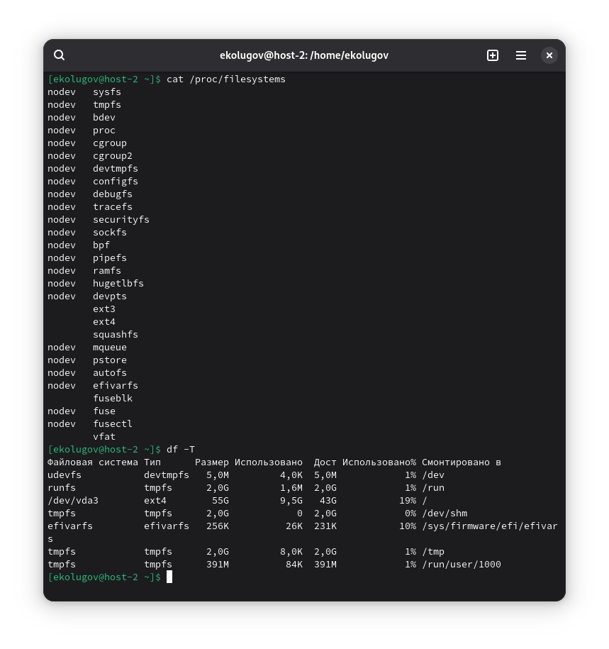
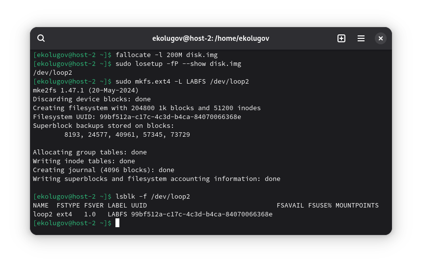
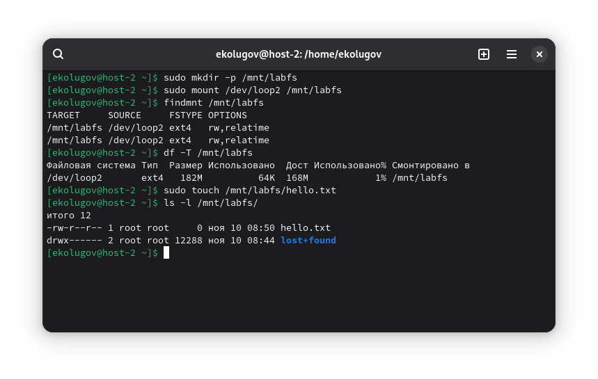
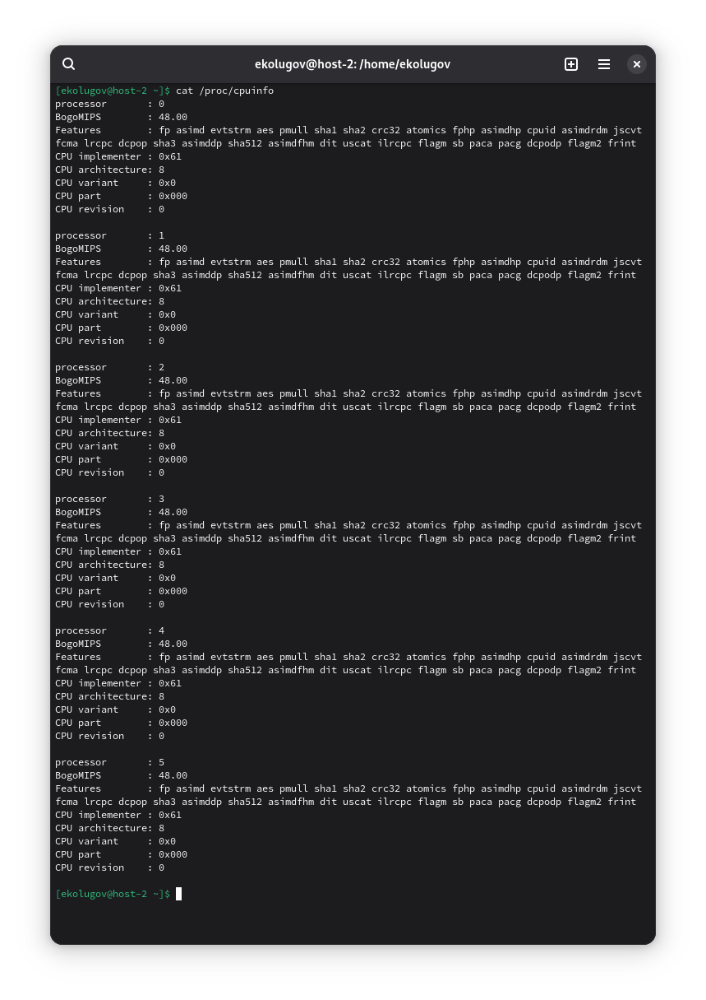
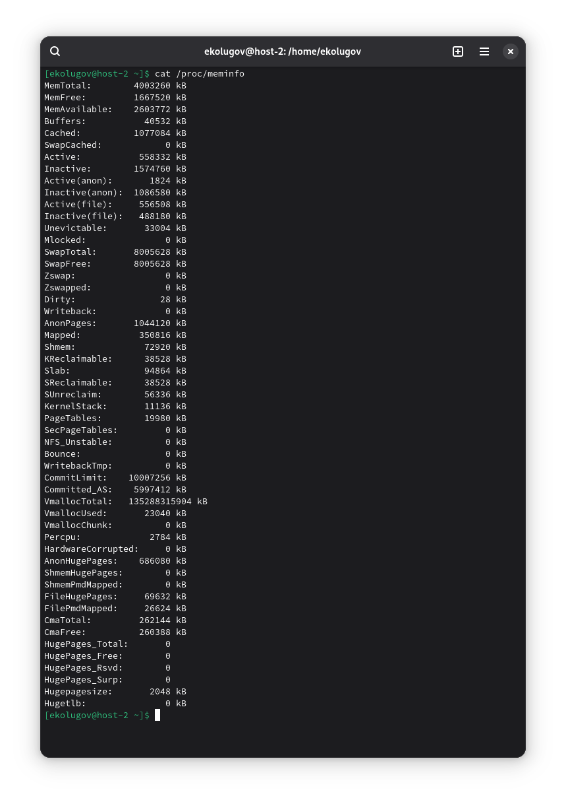

1) Какие файловые системы вы знаете?

- На диске: ext2/3/4, XFS, Btrfs, NTFS, FAT32
- Виртуальные (в памяти/ядре): proc, sysfs, tmpfs, devtmpfs, ramfs
- Образные: ISO9660, UDF

2) Как можно классифицировать файловые системы? В чем отличия?

- По назначению: дисковые, сетевые, виртуальные, образные
- По архитектуре: журналируемые (ext4, XFS), не журналируемые (ext2), снимки (Btrfs, ZFS)
- По носителю: HDD/SSD, флеш-оптимизированные (F2FS), RAM (tmpfs/ramfs)

Из отличией можно выделить журналируемость и его тип, поддержка снимков, сжатия, RAID-массивов, поддержка ядра

3) Какие файловые системы используются в Linux?

```
cat /proc/filesystems

df -T
```



4) Как создать файловую систему на диске?

Безопасная демонстрация на loop-устройстве:

```
fallocate -l 200M disk.img

losetup -fP --show disk.img

mkfs.ext4 -L LABFS /dev/loop2

lsblk -f /dev/loop2
```

Была создана файловая система ext4



5) Как подключить диск в систему, что такое монтирование?

Монтирование - присоединение файловой системы к каталогу mountpoint в едином дереве.

```
mkdir -p /mnt/labfs
mount /dev/loop2 /mnt/labfs

findmnt /mnt/labfs
df -T /mnt/labfs

touch /mnt/labfs/hello.txt
ls -l /mnt/labfs
```



6) procfs, cifs, tmpfs, sysfs - особенности и где смонтированы

- procfs: виртуальная ФС ядра с информацией о процессах и системе; смонтирована в /proc.
- sysfs: представление устройств/драйверов/шины; смонтирована в /sys.
- tmpfs: ФС в RAM/swap; динамически использует память.
- cifs: сетевой доступ к SMB/Windows/Samba.

6) Как получить информацию о системе, используя лишь cat? Вывести информацию о процессоре и памяти

- /etc/os-release — сведения о дистрибутиве.
- /proc/cpuinfo — сведения о CPU.
- /proc/meminfo — сведения о памяти.
- /proc/uptime — время работы системы.
- /proc/loadavg — средняя нагрузка.
- /proc/cmdline — параметры загрузки ядра.
- /proc/partitions — разделы.
- /proc/swaps — подключённые swap-устройства.

```
cat /proc/cpuinfo
```



```
cat /proc/meminfo
```



