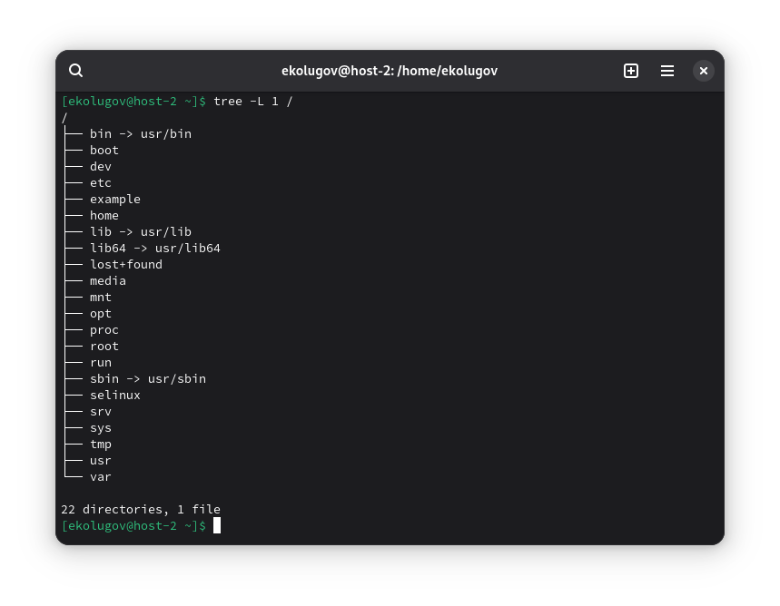

1) Какая структура каталогов в Linux? Выведите список каталогов в корне

- /bin: базовые команды для всех пользователей
- /sbin: базовые команды администрирования
- /boot: загрузчик и ядро
- /dev: устройства
- /etc: конфигурация системы
- /home: домашние каталоги пользователей
- /lib, /lib64: общесистемные библиотеки
- /media, /mnt: точки временного/съёмного монтирования
- /opt: сторонние приложения
- /proc: виртуальная ФС ядра (процессы/параметры)
- /root: домашний каталог суперпользователя
- /run: временные рантайм-данные
- /srv: данные сервисов
- /sys: виртуальная ФС устройств/драйверов
- /tmp: временные файлы
- /usr: «пользовательские» приложения и данные (неизменяемая часть)
- /var: изменяемые данные (логи, очереди, кэш)

```
tree -L 1 /
```



2) Где хранятся папки пользователей в системе?

Домашние каталоги хранятся в /home/`имя пользователя`.

3) Где домашняя папка суперпользователя?  

У root домашняя папка - /root.

4) Где хранятся основные конфигурационные файлы в системе?

Основная директория конфигурации - /etc.

5) Что за папки /bin, /sbin, /usr/bin, /usr/sbin?

- /bin: базовые пользовательские утилиты, нужные в однопользовательском режиме (sh, ls, cp, mv, cat).
- /sbin: базовые системные утилиты для администраторов.
- /usr/bin: остальной (необязательный для ранней загрузки) пользовательский софт.
- /usr/sbin: остальной админский софт.