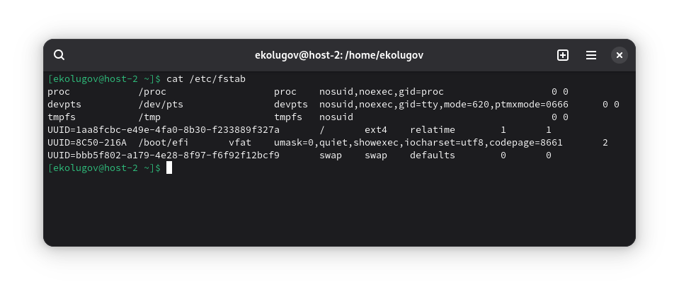
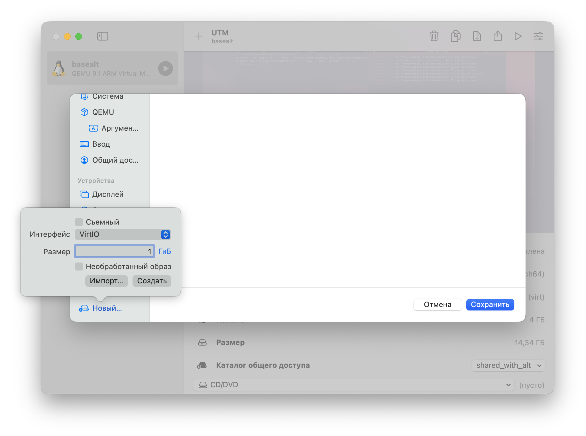
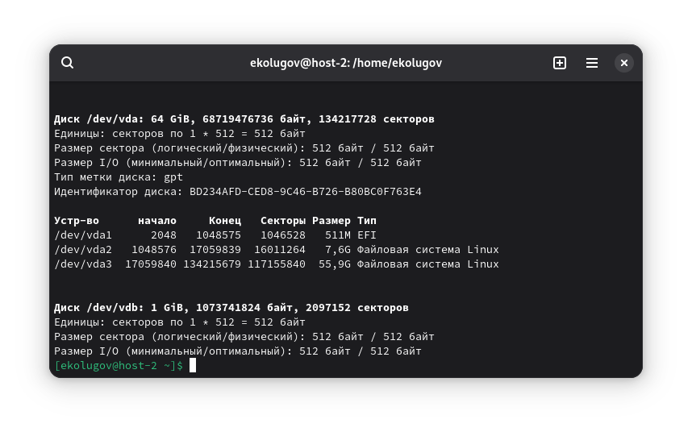
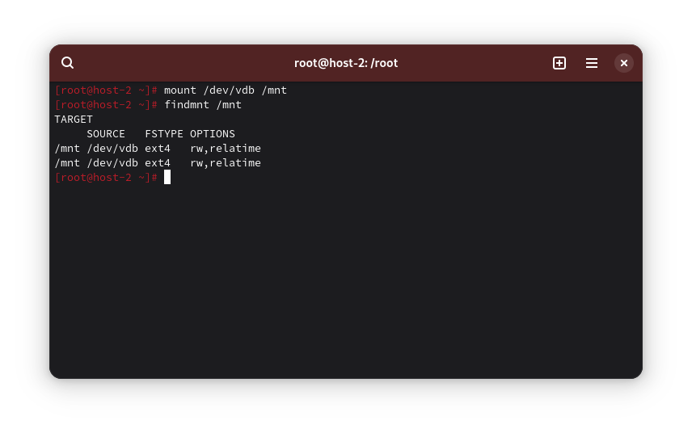
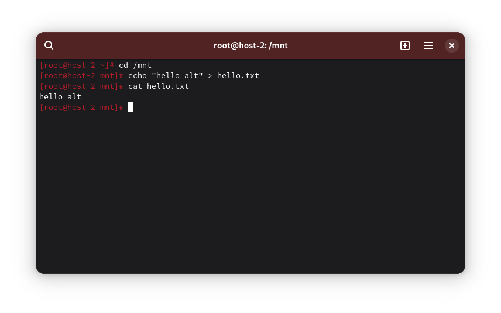
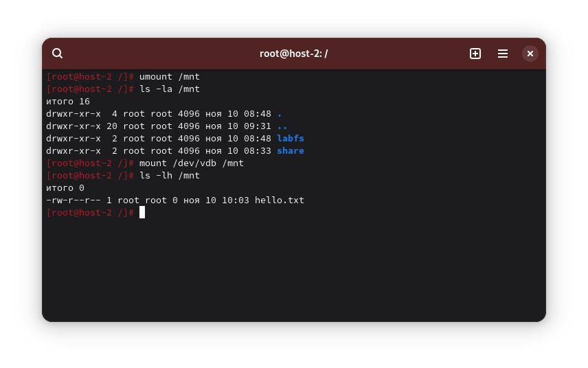
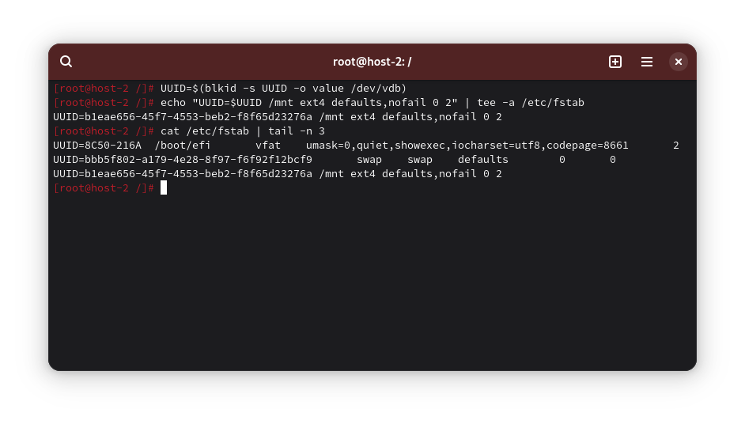
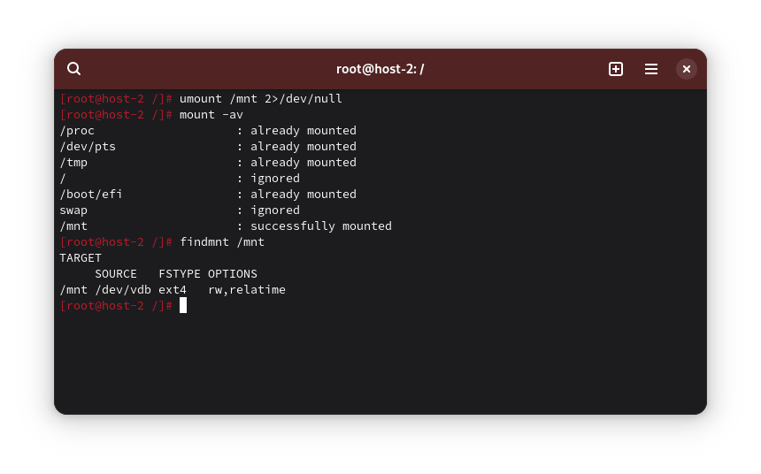

1) Выведите содержимое fstab. Что хранится в fstab?

Файл /etc/fstab описывает постоянные точки монтирования: что монтировать (UUID/устройство) и куда.

```
cat /etc/fstab
```



2) Добавьте в виртуальную машину ещё один диск



3) Узнайте, как система видит ваш диск - выведите информацию о блочных устройствах



Добавленный диск - /dev/vdb

4) Создайте на диске таблицу разделов и файловую систему ext4

```
parted -s /dev/vdb mklabel gpt
parted -s mkpart primary ext4 100MiB 100%

partprobe /dev/vdb

mkfs.ext4 -L DATA /dev/vdb

lsblk -f /dev/vdb /dev/vdb1
```


5) Примонтируйте диск в каталог /mnt

```
mkdir -p /mnt
mount /dev/vdb /mnt

findmnt /mnt
```



6) Зайдите в каталог и создайте там файлы



7) Отмонтируйте диск и проверьте, остались ли файлы

```
umount /mnt

ls -la /mnt

mount /dev/vdb /mnt
ls -lh /mnt
```



8) Настройте автоподключение при загрузке

```
UUID=$(blkid -s UUID -o value /dev/vdb)
echo "UUID=$UUID /mnt ext4 defaults,nofail 0 2" | tee -a /etc/fstab
```



9) Проверьте корректность записей fstab перед перезагрузкой

```
umount /mnt 2>/dev/null
mount -av
findmnt /mnt
```



10) Перезагрузите систему и убедитесь, что диск подключён

```
reboot
findmnt /mnt
```

