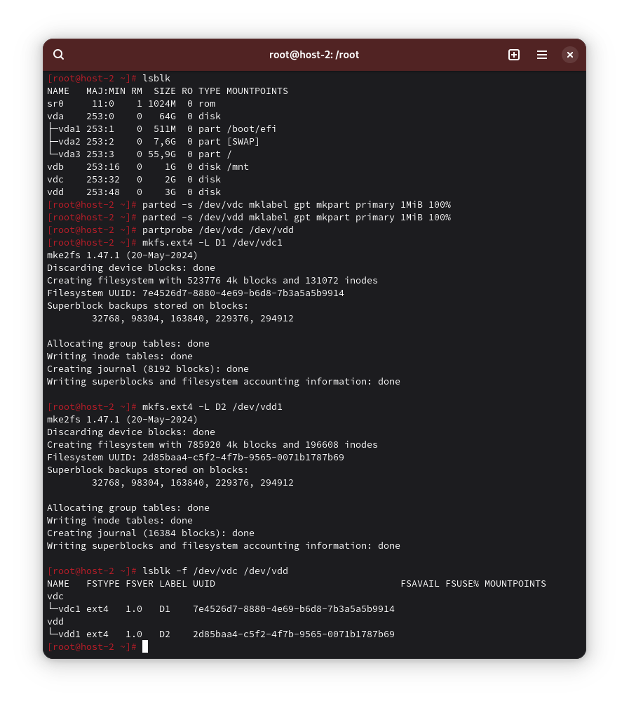
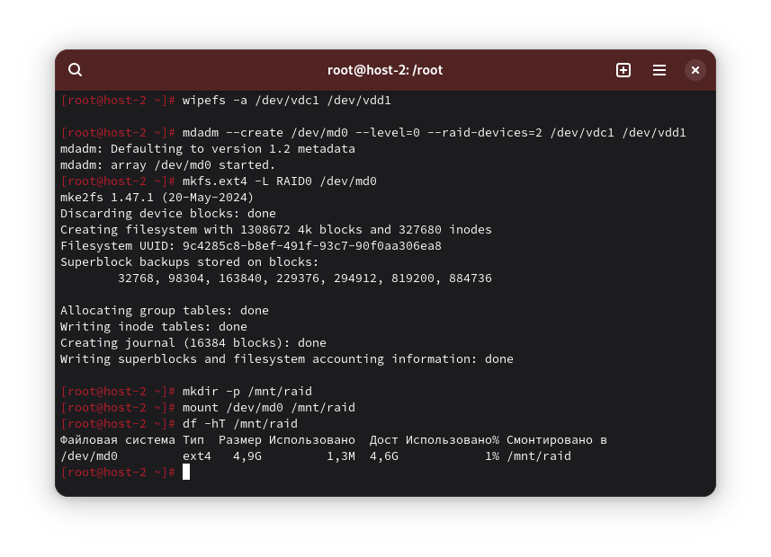
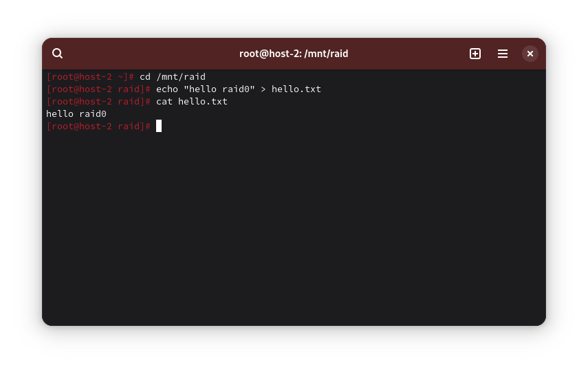
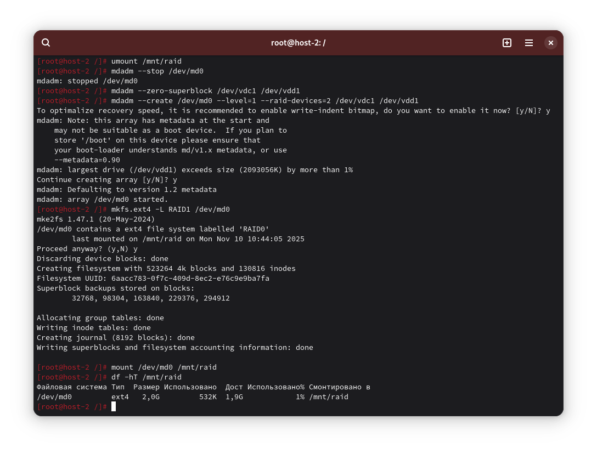

1) RAID-массивы: что это и какие бывают

RAID - объединение нескольких дисков ради отказоустойчивости, скорости, или и того, и другого.

Бывают: программный и аппаратный (контроллер)

Уровни:
- RAID0 - чередование блоков. Быстро, но без отказоустойчивости
- RAID1 - зеркалирование. Отказоустойчивость одного диска, скорость чтения выше, скорость записи равна минимальной из двух скоростей дисков.

2) Добавьте в виртуальную машину 2 диска и отформатируйте их в ext4

```
parted -s /dev/vdc mklabel gpt mkpart primary 1MiB 100%
parted -s /dev/vdd mklabel gpt mkpart primary 1MiB 100%
partprobe /dev/vdc /dev/vdd

mkfs.ext4 -L D1 /dev/vdc1
mkfs.ext4 -L D2 /dev/vdd1
lsblk -f /dev/vdc /dev/vdd
```



3) Создайте из них RAID0

```
wipefs -a /dev/vdc1 /dev/vdd1

mdadm --create /dev/md0 --level=0 --raid-devices=2 /dev/vdc1 /dev/vdd1

mkfs.ext4 -L RAID0 /dev/md0
mkdir -p /mnt/raid
mount /dev/md0 /mnt/raid
df -hT /mnt/raid
```



4) Проверьте, всё ли работает

```
cd /mnt/raid
echo "hello raid0" > hello.txt

cat hello.txt
```



5) Удалите RAID0 и создайте RAID1

Отмонтируем и остановим md0, затем создадим RAID1 и смонтируем его:
```
umount /mnt/raid
mdadm --stop /dev/md0
mdadm --zero-superblock /dev/vdc1 /dev/vdd1

mdadm --create /dev/md0 --level=1 --raid-devices=2 /dev/vdc1 /dev/vdd1

mkfs.ext4 -L RAID1 /dev/md0
mount /dev/md0 /mn/raid
df -hT /mnt/raid
```



6) В чём разница между RAID0 и RAID1?

- RAID0: максимальная производительность и ёмкость (сумма дисков), НЕТ отказоустойчивости. Потеря одного диска = потеря массива.
- RAID1: зеркалирование, хранит копию данных на каждом диске. Ёмкость = размер одного диска, отказоустойчивость: выдерживает отказ 1 диска.

7) Есть ли файловые системы, которые поддерживают RAID без стороннего ПО?

Да, есть. Например: Btrfs, ZFS.

8) Можно ли создать RAID во время установки системы?

Да. Большинство установщиков Linux позволяют во время установки создать программный RAID, затем установить систему на него.