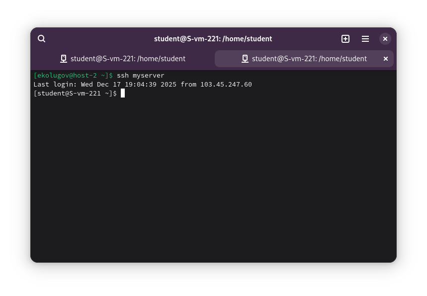
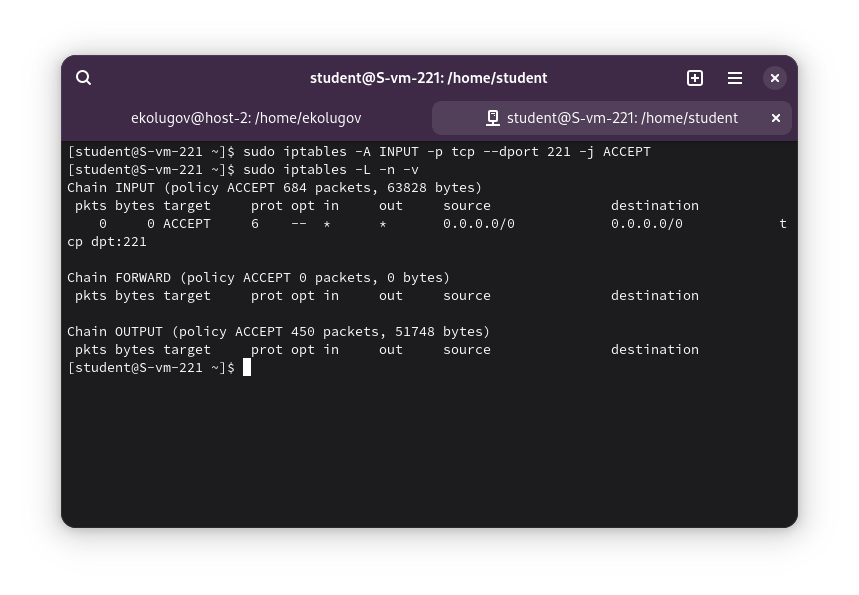
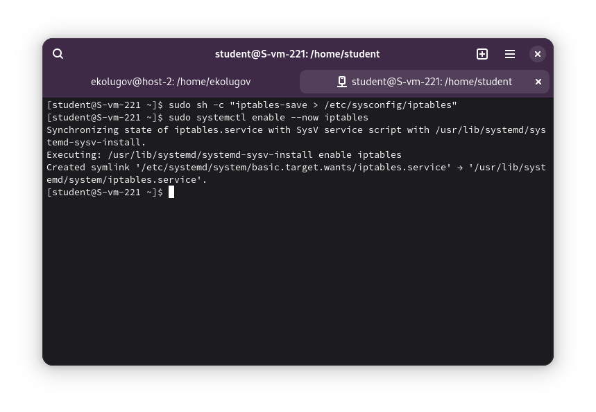

1 Установка iptables

Я установил пакет iptables

```bash
sudo apt-get update
sudo apt-get install iptables
```
2 Проверка возможности подключения

Я открыл новое окно терминала (не закрывая старое!) и попробовал подключиться:
```bash
ssh myserver
```

**Результат:** Подключение прошло успешно.



3 Почему может пропасть возможность подключения?

Возможность подключения может пропасть, если:
1.  Политика по умолчанию для входящих пакетов (`INPUT`) изменена на **DROP** (сбрасывать) или **REJECT** (отклонять).
2.  При этом **нет разрешающего правила** для порта SSH.

В таком случае сервер будет просто игнорировать или сбрасывать попытки подключения, так как они не разрешены явно.

5 Открытие порта на сервере

Чтобы гарантировать доступ к серверу по моему SSH-порту, я добавляю разрешающее правило.
ш-
Команда:
```bash
sudo iptables -A INPUT -p tcp --dport 221 -j ACCEPT
```

*   `-A INPUT`: добавить правило в цепочку входящих соединений.
*   `-p tcp`: протокол TCP.
*   `--dport 221`: порт назначения 221 (мой SSH порт).
*   `-j ACCEPT`: действие — принять пакет.

Проверить текущие правила можно командой:
```bash
sudo iptables -L -n -v
```



6 Это будет UDP или TCP порт?

SSH использует протокол **TCP**, так как ему требуется надежное соединение с гарантией доставки пакетов в правильном порядке. Поэтому в правиле выше я указал `-p tcp`.

7 Сохраняются ли правила после перезагрузки?

Нет. По умолчанию правила `iptables`, введенные в консоли, применяются только к текущей сессии ядра (в оперативной памяти). После перезагрузки сервера они сбросятся к исходному состоянию (обычно — пустой список).

8 Как их сохранить?

Чтобы правила применялись автоматически при запуске системы, их нужно сохранить в файл конфигурации, который считывается при старте службы.

В ALT Linux (и многих RHEL-подобных системах) для этого используется команда `iptables-save`, вывод которой перенаправляется в системный файл.

1.  Сохраняю правила в файл:
    ```bash
    sudo sh -c "iptables-save > /etc/sysconfig/iptables"
    ```

2.  Включаю службу iptables, чтобы она загружала эти правила при старте системы:
    ```bash
    sudo systemctl enable --now iptables
    ```

Теперь настройки фаервола сохранятся после перезагрузки.

