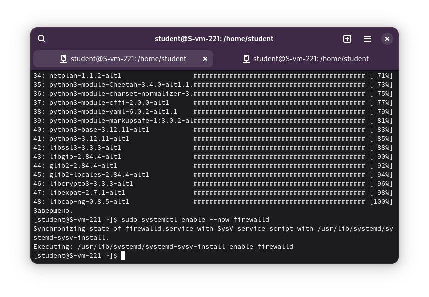
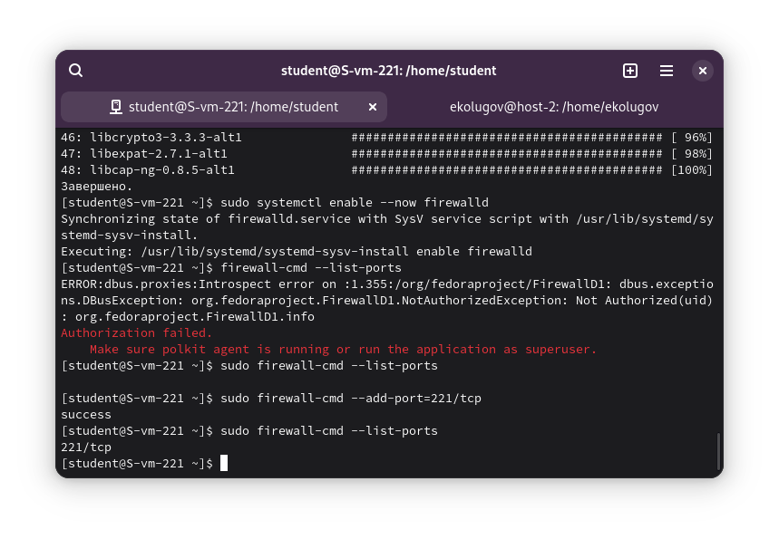
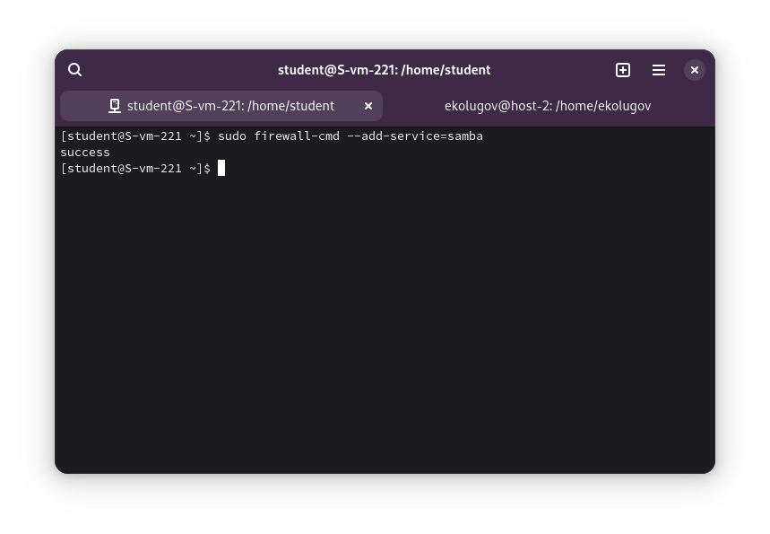
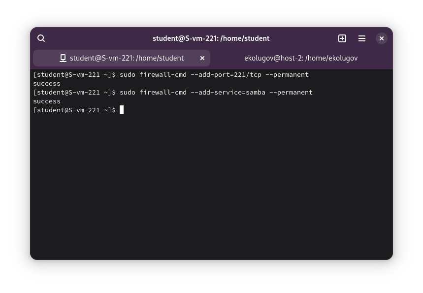

1 Удаление iptables и установка firewalld

Выполняю команды на сервере:

1.  Останавливаю и отключаю службу iptables:
    ```bash
    systemctl stop iptables
    systemctl disable iptables
    ```

2.  Устанавливаю firewalld:
    ```bash
    apt-get update
    apt-get install firewalld
    ```

3.  Запускаю firewalld:
    ```bash
    systemctl enable --now firewalld
    ```



2 Проверка подключения по SSH

Я открыл **новое** окно терминала на своем компьютере и попробовал подключиться.

Команда:
```bash
ssh myserver
```

Подключение удалось. Странно :) Должно было закрыть доступ

3 Открытие порта

Возвращаюсь в **старую (активную)** сессию SSH (где я еще подключен) и открываю свой порт.

```bash
firewall-cmd --add-port=221/tcp
```

5 Вывод списка открытых портов

Чтобы посмотреть, какие порты открыты прямо сейчас вручную:

```bash
firewall-cmd --list-ports
```

**Результат:** Должно показать `221/tcp`.



6 Можно ли там добавить порты по названию сервиса?

Да, `firewalld` поддерживает добавление правил по названию сервисов. Это удобнее, так как не нужно помнить номера портов.

Пример команды (добавляет стандартный порт SSH - 22):
```bash
firewall-cmd --add-service=ssh
```
Список всех доступных сервисов можно посмотреть командой `firewall-cmd --get-services`.

6 7 Настройка Samba на Локальной виртуальной машине

Для работы Samba нужно открыть следующие порты (или просто сервис samba).

Я открываю доступ к сервису Samba:

```bash
sudo firewall-cmd --add-service=samba
```



8 Сделайте так, чтобы изменения были постоянными

Команды `firewall-cmd`, которые я вводил выше, действуют только до перезагрузки (runtime). Чтобы сохранить их навсегда, нужно использовать флаг `--permanent` и затем перезагрузить правила.

1.  **Для удаленного сервера (порт 221):**
    ```bash
    firewall-cmd --add-port=221/tcp --permanent
    firewall-cmd --reload
    ```

2.  **Для локальной машины (Samba):**
    ```bash
    sudo firewall-cmd --add-service=samba --permanent
    sudo firewall-cmd --reload
    ```

Теперь настройки сохранятся после перезагрузки сервера.

