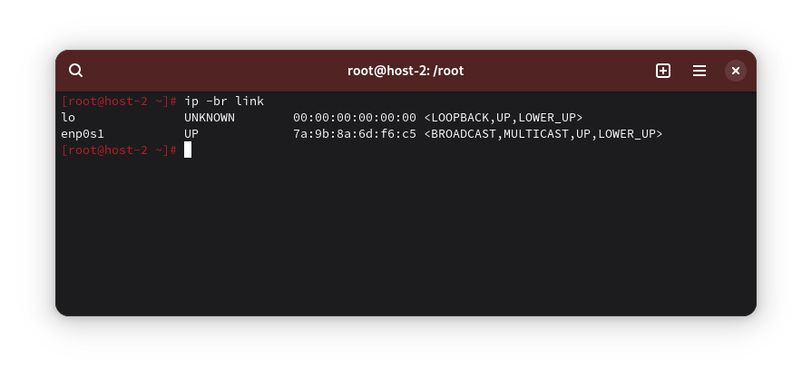
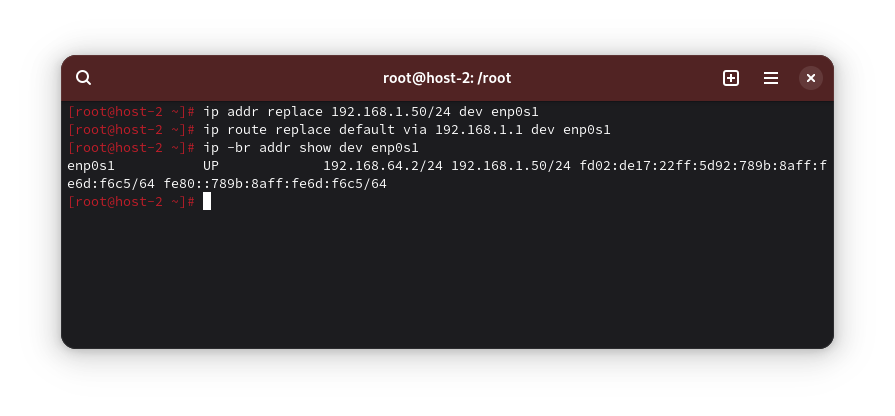
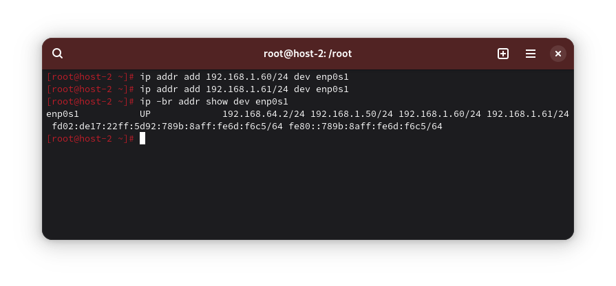
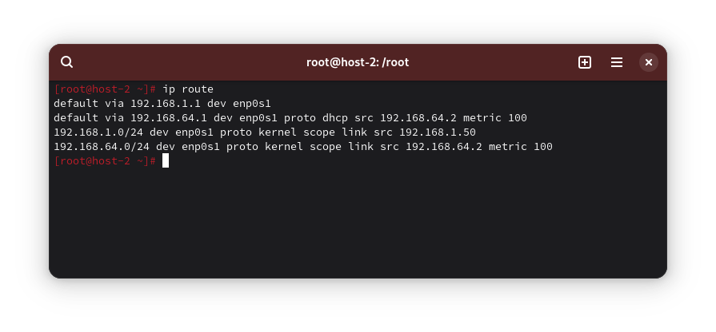
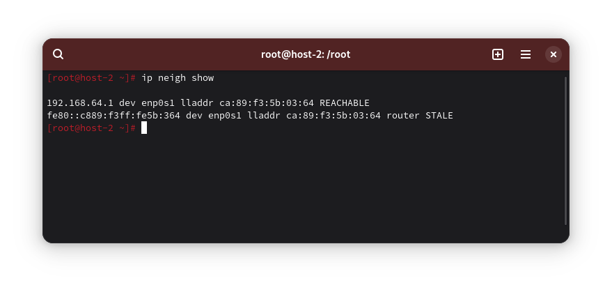

1) Вывести список интерфейсов. Какими способами?

```
ip -br link
```



2) Изменить IP-адрес

```
ip addr replace 192.168.1.50/24 dev enp0s1
ip route replace defaut via 192.168.1.1 dev enp0s1
```



3) Добавить несколько IP-адресов на один интерфейс

```
ip addr add 192.168.1.60/24 dev enp0s1
ip addr add 192.168.1.61/24 dev enp0s1
```



4) Вывести список маршрутов

```
ip route
```



5) Вывести ARP-таблицу

```
ip neigh show
```



6) Что такое IP-адрес?

Уникальный сетевой адрес узла. Бывает IPv4 (32 бита, запись как 192.168.1.10) и IPv6 (128 бит, запись как 2001:db8::1). Содержит сетевую часть и хостовую часть (определяются маской/префиксом).

7) Для чего нужны маршруты?

Указывают, куда отправлять пакеты для конкретных сетей: локально (напрямую) или через шлюз (next hop).

8) Что за протокол ARP?

Address Resolution Protocol - сопоставляет IPv4-адреса с MAC-адресами в пределах одного широковещательного домена (канальный уровень).

9) Что такое DHCP?

Dynamic Host Configuration Protocol - автоматическая выдача параметров сети: IP, маска, шлюз, DNS и др.

10) Что такое DNS?

Domain Name System - перевод доменных имён в IP и обратно, и другие записи (MX, TXT, NS и т. п.).

11) Один из протоколов синхронизации времени

NTP (Network Time Protocol). Также используются chrony (клиент/сервер NTP), PTP (Precision Time Protocol).

12) Что такое широковещательный запрос? Зачем он нужен?

Сообщение, отправляемое всем узлам в пределах широковещательного домена (L2-сегмента).

Нужен для обнаружения соседей/служб, когда MAC/сервер неизвестен.

13) Какой адрес является широковещательным?

Для конкретной IPv4-подсети - адрес, где хостовая часть все единицы (например, для 192.168.1.0/24 - 192.168.1.255). Специальный ограниченный широковещательный - 255.255.255.255.

14) Какие ещё параметры можно задать сетевой карте?

Можно задать адресацию, можно задать на канальном уровне MTU, MAC-адрес (временная смена), включить-выключить адрес, скорость соединения и т.д.

15) Что такое маска подсети? Зачем она нужна?

Маска подсети (например, 255.255.255.0 или префикс /24) определяет, какая часть IP-адреса - сеть, а какая - хост. Нужна для: определения «локальности» узлов (нужен ли шлюз), вычисления широковещательного адреса и размера подсети, выбора маршрута.