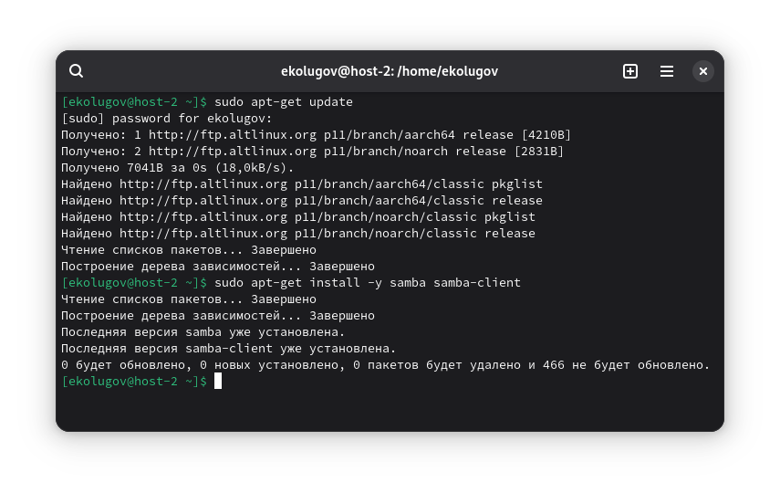
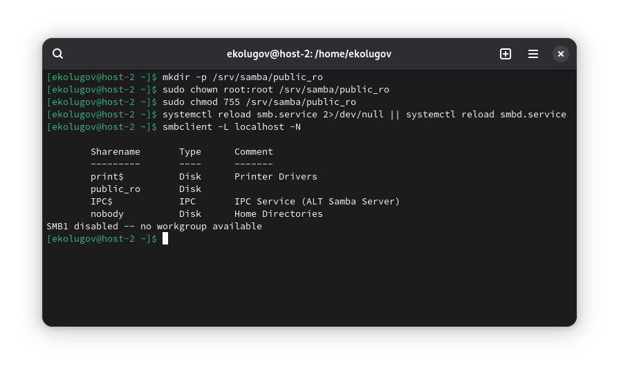
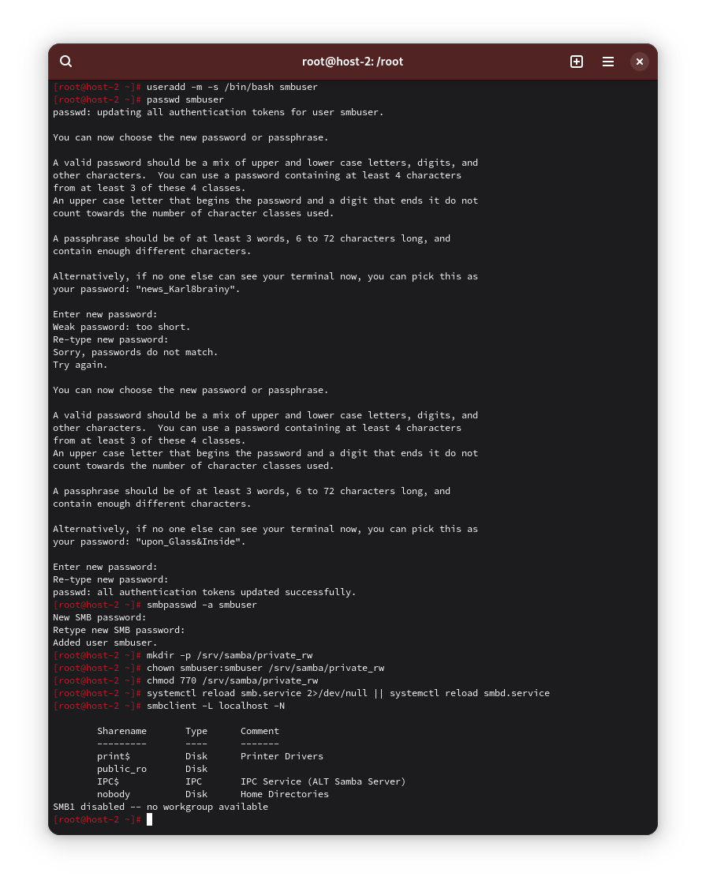
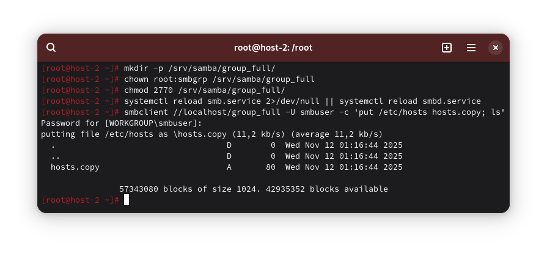
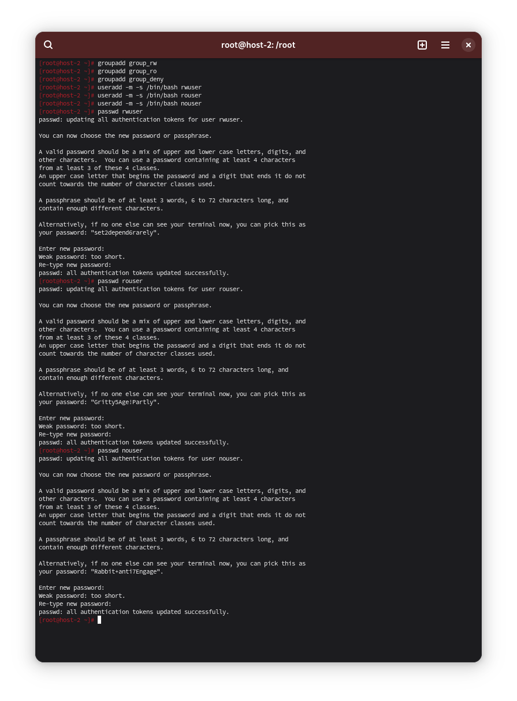
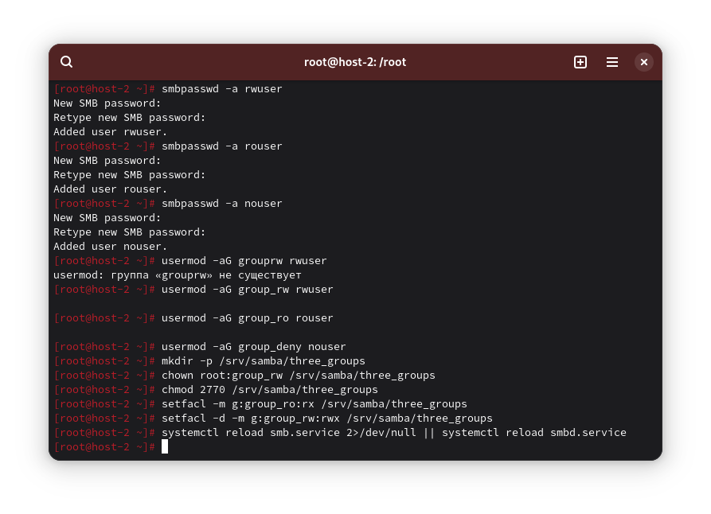
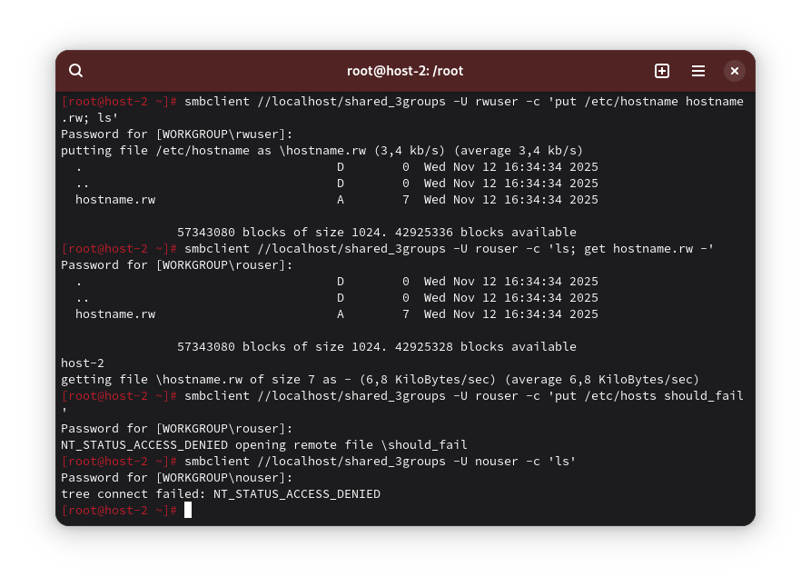

1) Установите пакет samba



2) Что такое общая папка и зачем она?

Общая папка это каталог, опубликованный сервером и доступный другим машинам в сети для чтения и/или записи. Нужна для централизованного хранения данных, обмена файлами между машинами в сети

3) Создайте общую папку без пароля, только чтение

```
mkdir -p /srv/samba/public_ro
chown root:root /srv/samba/public_ro
chmod 755 /srv/samba/public_ro
```

Внесу правки в smb.conf:

```
[global]
   workgroup = WORKGROUP
   server string = ALT Samba Server
   security = user
   map to guest = Bad User
   # лог локально, без излишней многословности
   log file = /var/log/samba/log.%m
   max log size = 1000

[public_ro]
   path = /srv/samba/public_ro
   browseable = yes
   public = yes
   guest ok = yes
   read only = yes
```

```
systemctl reload smb.service 2>/dev/null || systemctl reload smbd.service
smbclient -L localhost -N
```



4) Создайте общую папку с паролем (чтение/запись)

Создам пользователя и добавлю его в базу Samba

```
useradd -m -s /bin/bash smbuser
passwd smbuser
smbpasswd -a smbuser
```

Расшарю папку:

```
mkdir -p /srv/samba/private_rw
chown smbuser:smbuser /srv/samba/private_rw
chmod 770 /srv/samba/private_rw
```

Добавлю в smb.conf изменения:

```
[private_rw]
   path = /srv/samba/private_rw
   browseable = yes
   read only = no
   valid users = smbuser
   create mask = 0660
   directory mask = 0770
```

Перезагружу юнит:

```
systemctl reload smb.service 2>/dev/null || systemctl reload smbd.service
smbclient //localhost/private_rw -U smbuser -c 'mkdir test; ls'
```



5) Создайте общую папку с доступом для группы

```
groupadd smbgrp
usermod -aG smbgrp smbuser

mkdir -p /srv/samba/group_full
chown root:smbgrp /srv/samba/group_full
chmod 2770 /srv/samba/group_full
```

Внесу правки в smb.conf:

```
[group_full]
   path = /srv/samba/group_full
   browseable = yes
   read only = no
   valid users = @smbgrp
   force group = smbgrp
   create mask = 0660
   directory mask = 2770
```

```
systemctl reload smb.service 2>/dev/null || systemctl reload smbd.service
smbclient //localhost/group_full -U smbuser -c 'put /etc/hosts hosts.copy; ls'
```



6) Общая папка: одна группа — полный доступ, другая — только чтение, третьей — нет доступа

Группы:

```
groupadd group_rw
groupadd group_ro
groupadd group_deny
```

Пользователи:

```
useradd -m -s /bin/bash rwuser
useradd -m -s /bin/bash rouser
useradd -m -s /bin/bash nouser

passwd rwuser
passwd rosuer
passwd nouser
```



Учетные записи Samba:

```
smbpasswd -a rwuser
smbpasswd -a rouser
smbpasswd -a nouser
```

Членство в группах:

```
usermod -aG group_rw rwuser
usermod -aG group_ro rouser
usermod -aG group_deny nouser
```

Каталоги:

```
mkdir -p /srv/samba/three_groups
chown root:group_rw /srv/samba/three_groups
chmod 2770 /srv/samba/three_groups

setfacl -m g:group_ro:rx /srv/samba/three_groups
setfacl -d -m g:group_rw:rwx /srv/samba/three_groups
```

Внесу в smb.conf правки:

```
[shared_3groups]
   path = /srv/samba/three_groups
   browseable = yes
   # По умолчанию только чтение через Samba…
   read only = yes
   # …но группе group_rw разрешим запись
   write list = @group_rw
   # Доступ только двум группам; третья (group_deny) сюда не входит
   valid users = @group_rw @group_ro
   force group = group_rw
   create mask = 0664
   directory mask = 2775
```

```
systemctl reload smb.service 2>/dev/null || systemctl reload smbd.service
```



Проверю доступы:

```
smbclient //localhost/shared_3groups -U rwuser -c 'put /etc/hostname hostname.rw; ls'
smbclient //localhost/shared_3groups -U rouser -c 'ls; get hostname.rw -'
smbclient //localhost/shared_3groups -U rouser -c 'put /etc/hosts should_fail' 
smbclient //localhost/shared_3groups -U nouser -c 'ls'
```




