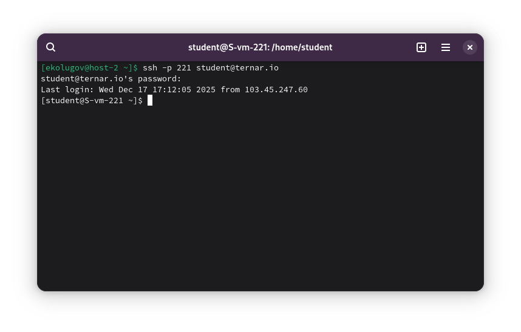
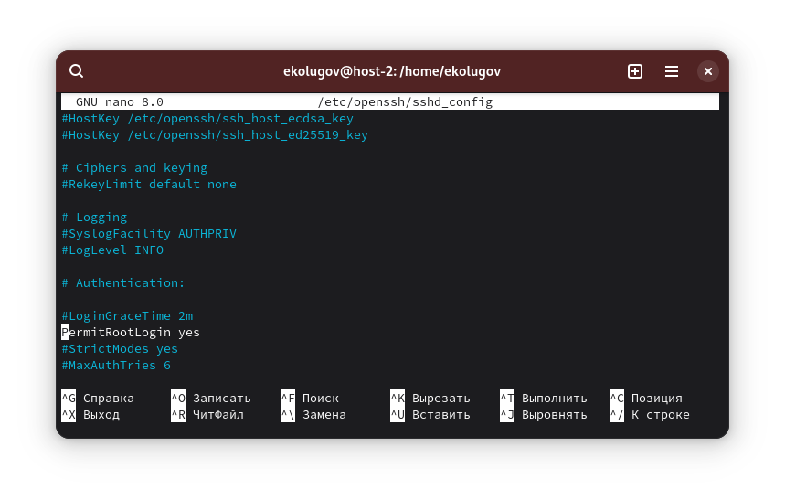
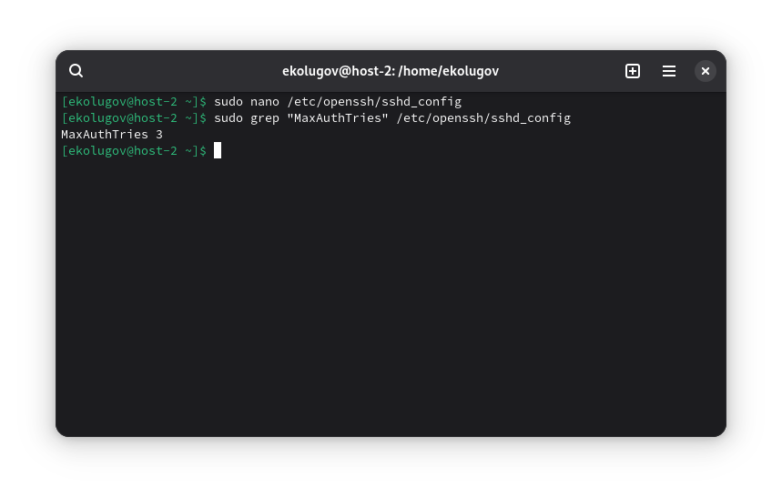
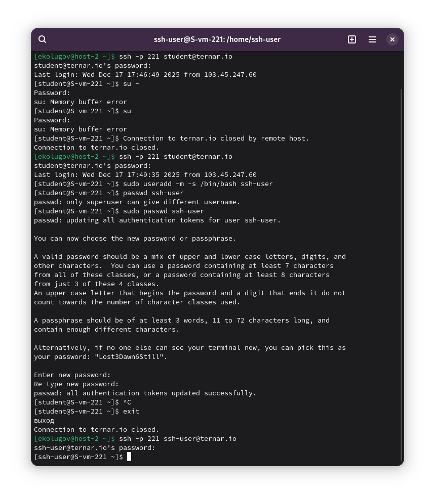

1) Какой по умолчанию используется порт для подключения?

По умолчанию протокол SSH использует порт 22.

2) Можно ли его изменить? Если да, то как?

Да, порт можно изменить в целях безопасности (security through obscurity), чтобы уменьшить количество автоматических атак ботов.

Для этого необходимо отредактировать файл конфигурации SSH-демона.
Нужно найти директиву `Port`, раскомментировать её (убрать символ `#`) и изменить значение 22 на желаемое (например, 2222).

Пример строки в конфиге:
```text
Port 2222
```

После изменения файла необходимо перезапустить службу SSH, чтобы настройки вступили в силу.

3) Какая служба отвечает за обработку запросов на подключения по ssh?

За обработку входящих подключений отвечает демон sshd (OpenSSH Daemon).

4) Какой файл конфигурации отвечает за его настройку?

Основной файл конфигурации сервера находится по пути:
`/etc/ssh/sshd_config`

5) Подключение к серверу по SSH

Подключаюсь к выданному серверу, используя стандартную команду.

Команда:
```bash
ssh -p 221 student@ternar.io
```



6) Настройка доступа для пользователя root

По умолчанию на многих системах прямой вход под root отключен. Чтобы его разрешить, я отредактировал файл конфигурации.

1. Открываю файл настроек:
   ```bash
   nano /etc/openssh/sshd_config
   ```
2. Нахожу параметр `PermitRootLogin`. Меняю его значение на `yes`:
   ```text
   PermitRootLogin yes
   ```
3. Перезапускаю службу sshd:
   ```bash
   systemctl restart sshd
   ```



7) Изменение количества ошибок ввода пароля

Я изменил количество попыток ввода пароля перед разрывом соединения (параметр `MaxAuthTries`). По умолчанию это значение обычно равно 6. Я установил значение 3.

1. Редактирую конфиг:
   ```bash
   nano /etc/ssh/sshd_config
   ```
2. Добавляю строку:
   ```text
   MaxAuthTries 3
   ```
3. Перезапускаю службу:
   ```bash
   systemctl restart sshd
   ```
4. Проверяю применение настройки с помощью `grep`:

```bash
grep "MaxAuthTries" /etc/ssh/sshd_config
```



8) Создание пользователя ssh-user и подключение

Создаю нового пользователя и задаю ему пароль:

```bash
useradd -m -s /bin/bash ssh-user
passwd ssh-user
```

Пробую подключиться под новым пользователем:

```bash
ssh -p 221 ssh-user@ternar.io
```



9) Ограничение возможности подключения для ssh-user

Теперь я запрещу этому пользователю подключаться по SSH, не удаляя самого пользователя из системы.

Попытка подключения после блокировки:
```bash
ssh -p 221 ssh-user@ternar.io
# Permission denied, please try again.
```

10) Как вы это сделали?

Для ограничения доступа я использовал директиву `DenyUsers` в файле конфигурации SSH. Это "черный список" пользователей.

1. Я добавил в конец файла `/etc/ssh/sshd_config` следующую строку:
   ```text
   DenyUsers ssh-user
   ```

2. Перезапустил службу:

   ```bash
   systemctl restart sshd
   ```

11) Что хранится в файле known_hosts?

Файл `known_hosts` (обычно находится в `~/.ssh/known_hosts` на клиенте) хранит список публичных ключей (отпечатков) серверов, к которым клиент ранее подключался.

Зачем он нужен:
1. Идентификация сервера: При первом подключении SSH спрашивает, доверяете ли вы этому хосту, и сохраняет его ключ.
2. Защита от MITM (Man-in-the-Middle): Если при следующем подключении ключ сервера изменится (например, сервер переустановили или кто-то пытается перехватить трафик, подменив сервер), SSH-клиент увидит несовпадение с записью в `known_hosts`, выдаст грозное предупреждение и заблокирует подключение.