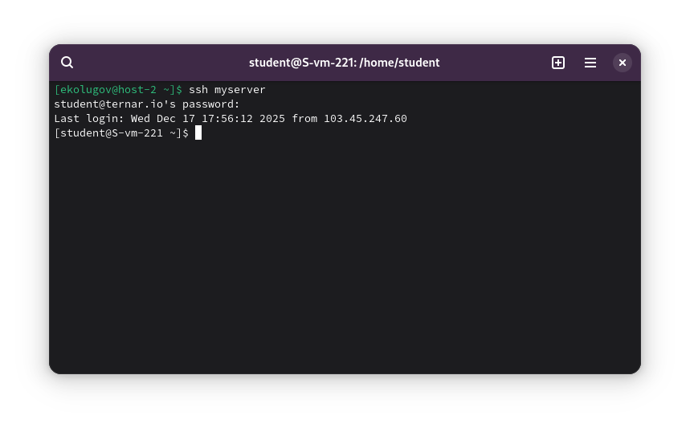

1) Где хранятся пользовательские и системные настройки подключения?

Настройки SSH-клиента хранятся в двух местах:

Пользовательские настройки (для текущего пользователя):
 `~/.ssh/config`

Системные настройки (для всех пользователей):
`/etc/openssh/ssh_config`

2) Что за файл options?

В контексте SSH под "файлом options" подразумевается файл конфигурации `~/.ssh/config`.

Этот файл позволяет создавать "алиасы" (псевдонимы) для подключений. Вместо того чтобы каждый раз вводить длинную строку вида `ssh -p 221 student@ternar.io`, можно один раз прописать параметры в этот файл и подключаться по короткому имени (например, `ssh lab`).

В нем можно указать:
*   `Host` — короткое имя для вызова.
*   `HostName` — реальный IP или домен сервера.
*   `User` — логин пользователя.
*   `Port` — порт подключения.
*   `IdentityFile` — путь к ключу (если используется вход по ключам).

3 и 4) Редактирование файла config и создание удобного имени

Я создал файл конфигурации в домашней директории и добавил туда настройки для лабораторного сервера.

1.  Создаю папку `.ssh` (если её нет) и открываю файл `config`:
    ```bash
    mkdir -p ~/.ssh
    nano ~/.ssh/config
    ```

2.  Вписываю следующие настройки (используя псевдоним `myserver`):

    ```text
    Host myserver
        HostName ternar.io
        User student
        Port 221
    ```

    *   **Host**: удобное имя, которое я буду вводить в консоли.
    *   **HostName**: адрес сервера.
    *   **User**: пользователь, под которым нужно зайти.
    *   **Port**: мой порт (221).


5. Проверка работоспособности

Теперь я подключаюсь к серверу, используя только придуманное имя, без ввода IP, порта и логина.

Команда:
```bash
ssh myserver
```

Система автоматически подставила пользователя `student`, адрес `ternar.io` и порт `221`. Осталось только ввести пароль.

