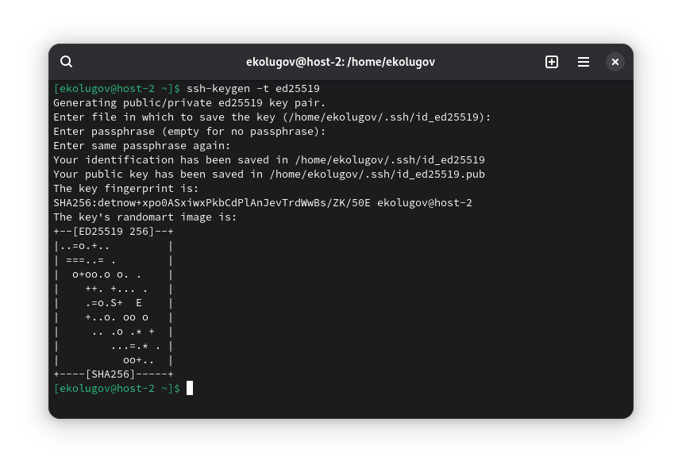
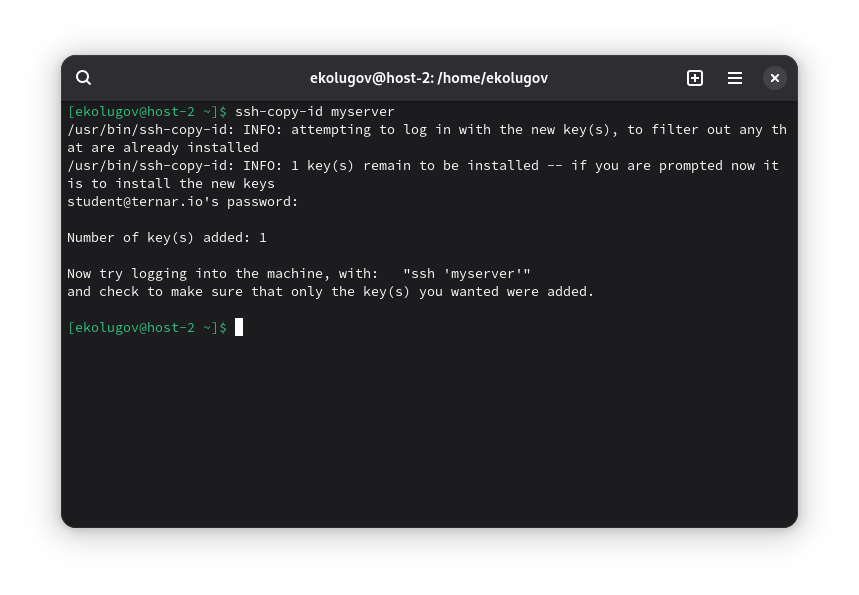
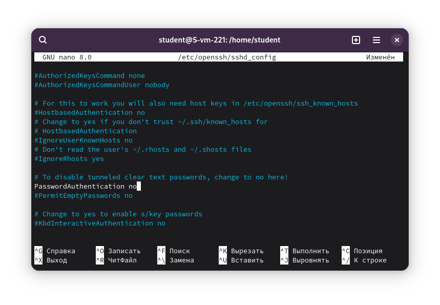

1) Что такое ssh ключи и зачем они нужны?

SSH-ключи — это способ идентификации пользователя, основанный на асимметричной криптографии. Пара состоит из двух частей:
*   **Публичный ключ (Public Key):** "Замок", который кладется на сервер. Он открыт и может передаваться по сети.
*   **Приватный ключ (Private Key):** "Ключ", который хранится только у пользователя на компьютере.

Они нужны для:
1.  **Безопасности:** Ключи намного сложнее подделать или подобрать (брутфорс), чем обычные пароли.
2.  **Удобства:** Позволяют входить на сервер без постоянного ввода пароля.
3.  **Автоматизации:** Необходимы для работы скриптов и систем деплоя (CI/CD), которые должны подключаться к серверам автоматически.

2 Как их создать?

Ключи создаются специальной утилитой `ssh-keygen`, которая идет в комплекте с SSH-клиентом.

3 Создание пары ключей ed25519

Я сгенерировал пару ключей

Выполняю команду на локальной машине:

```bash
ssh-keygen -t ed25519
```

В процессе создания я нажимал `Enter`, чтобы сохранить ключи в стандартное место и не задавать парольную фразу (passphrase).

**Где они хранятся:**
По умолчанию ключи сохраняются в скрытой папке `.ssh` домашней директории пользователя:
*   Приватный ключ: `~/.ssh/id_ed25519`
*   Публичный ключ: `~/.ssh/id_ed25519.pub`



 4 Копирование публичного ключа на сервер

Чтобы сервер меня "узнавал", нужно передать ему мой публичный ключ. Для этого я использую утилиту `ssh-copy-id`. Так как я ранее настроил конфиг, я использую короткое имя сервера.

```bash
ssh-copy-id myserver
```

Я ввел пароль пользователя `student` в последний раз для подтверждения копирования.



5 Проверка подключения

Пробую подключиться к серверу снова:

```bash
ssh myserver
```

**Результат:** Пароль не запрошен. Я мгновенно попал в консоль сервера. Это означает, что аутентификация по ключу работает успешно.

![][./screen-03.png]

6 Запрет входа по паролю

Теперь я нахожусь **на сервере**. Мне нужно отредактировать конфигурацию демона SSH, чтобы никто не мог подобрать пароль к серверу.

1.  Открываю файл конфигурации:
    ```bash
    sudo nano /etc/openssh/sshd_config
    ```

2.  Нахожу параметр `PasswordAuthentication`. Раскомментирую его и меняю значение на `no`:
    ```text
    PasswordAuthentication no
    ```

3.  Сохраняю файл и перезапускаю службу SSH:
    ```bash
    systemctl restart sshd
    ```

Теперь к серверу можно подключиться только имея правильный приватный ключ.

