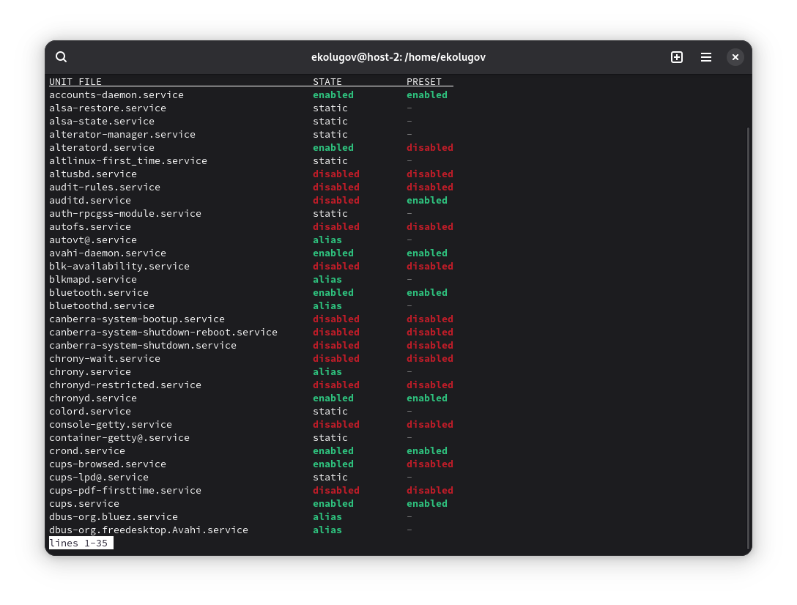
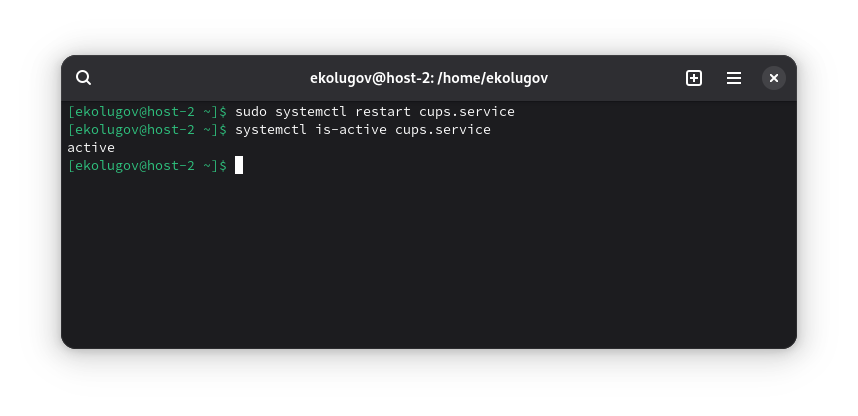
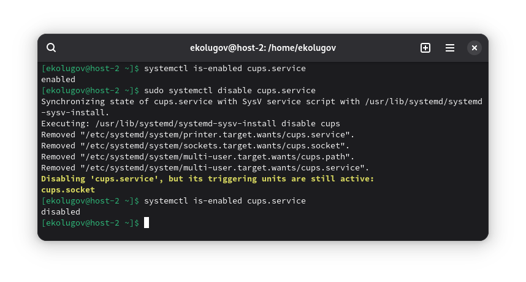
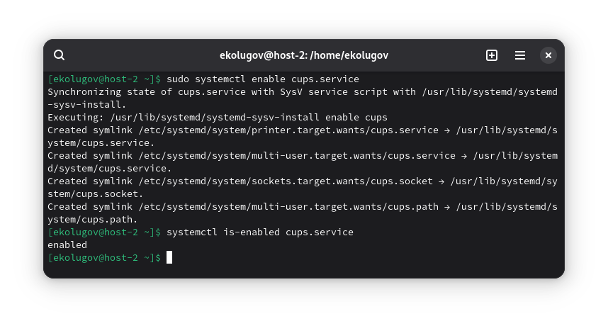

1) Что такое systemd-юнит?

Юнит — это объект systemd: описание служб: например, таймера, точки монтирования и прочее. Хранится в .service, .timer, .mount, .socket, .target, .path, .slice, .swap, .device, .scope.

2) Проверить статус любого systemd-юнита. Что выводит команда?

```
systemctl list-unit-files --type=service
```



3) Попробуйте остановить сервис

```
sudo systemctl stop bluetooth.service
systemctl is-active bluetooth.service
```


4) Перезапустите его

```
sudo systemctl restart bluetooth.service
systemctl is-active bluetooth.service
```



5) Удалите из автозагрузки

```
sudo systemctl disable cups.service
```



6) Верните обратно

```
sudo systemctl enable cups.service
```



7) Что такое таймеры?

Это планировщики systemd, запускают .service по расписанию. Может запускать по событию (OnBootSec, OnUnitActiveSec, OnUnitInactiveSec, т.д.), может запускать по календарю (OnCalendar=daily или Mon...Fri 09:00)

