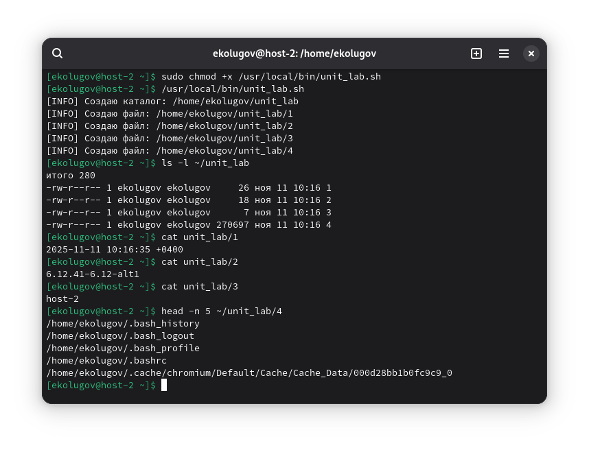
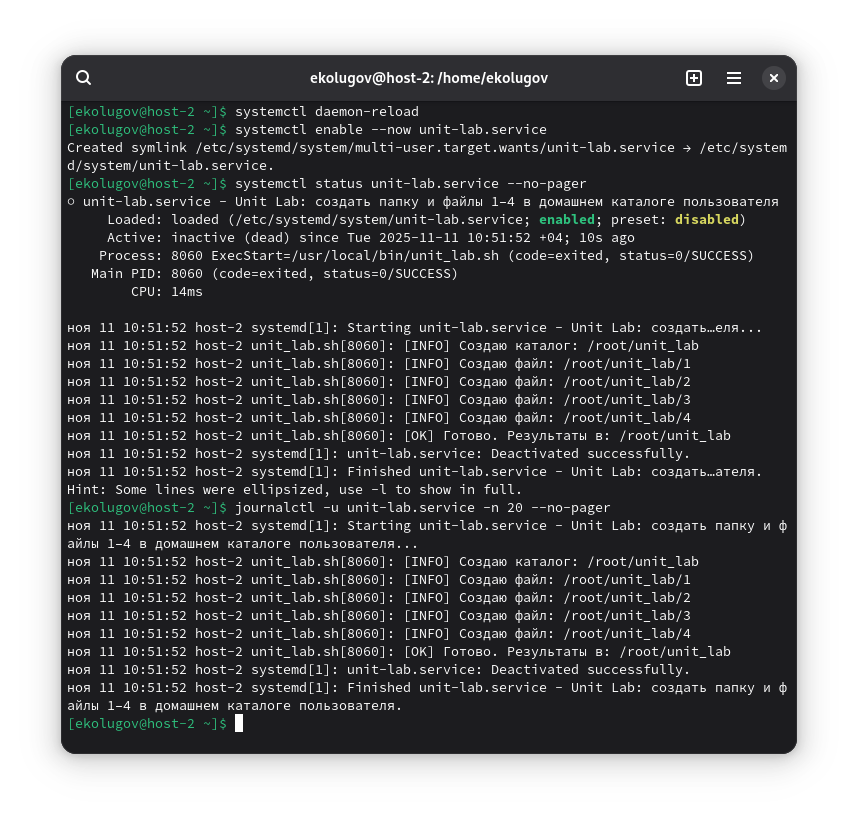
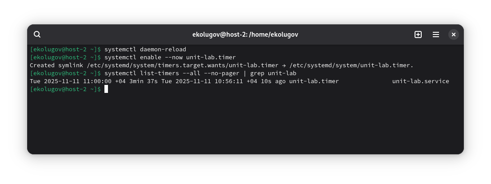
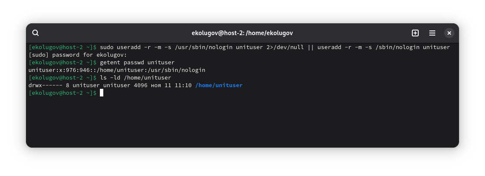
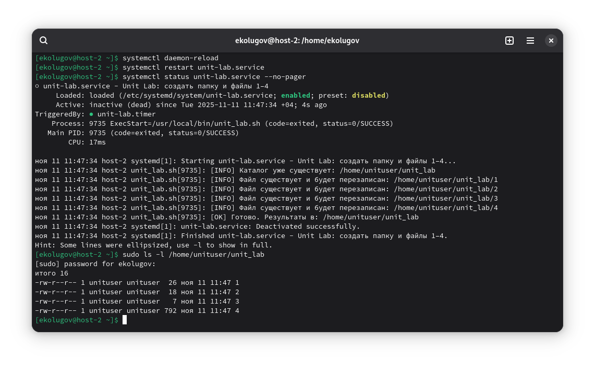

1) Скрипт: создаёт папку, файлы 1-4 и записывает в них нужную информацию

Требования:

- Проверка существования папки/файлов.
- Записывает:  
    1 — текущую дату/время;  
    2 — версию ядра;  
    3 — имя компьютера;  
    4 — список всех файлов в домашнем каталоге пользователя, от имени которого выполняется скрипт.
- Должен выполняться в домашней папке независимо от текущего каталога.
- Включаем set -euo pipefail для удобной отладки:
    - -e: завершить скрипт при первой ошибке команды;
    - -u: ошибка при обращении к несуществующей переменной;
    - -o pipefail: если любая команда в конвейере (pipe) упала — весь конвейер считается ошибкой.

```bash
#!/bin/bash
set -euo pipefail
IFS=$'\n\t'

# Определяем домашний каталог вызывающего пользователя надёжно
if [ -n "${HOME:-}" ] && [ -d "$HOME" ]; then
  USER_HOME="$HOME"
else
  USER_HOME="$(getent passwd "$(id -u)" | cut -d: -f6)"
fi

# Гарантируем выполнение в домашней папке того, кто запускает скрипт
cd "$USER_HOME"

TARGET_DIR="$USER_HOME/unit_lab"

# Проверка/создание каталога
if [ -d "$TARGET_DIR" ]; then
  echo "[INFO] Каталог уже существует: $TARGET_DIR"
else
  echo "[INFO] Создаю каталог: $TARGET_DIR"
  mkdir -p "$TARGET_DIR"
fi

# Список целевых файлов
for f in 1 2 3 4; do
  p="$TARGET_DIR/$f"
  if [ -e "$p" ]; then
    echo "[INFO] Файл существует и будет перезаписан: $p"
  else
    echo "[INFO] Создаю файл: $p"
    : > "$p"
  fi
done

# 1 — текущая дата/время
date '+%F %T %z' > "$TARGET_DIR/1"

# 2 — версия ядра
uname -r > "$TARGET_DIR/2"

# 3 — имя компьютера (предпочтительно hostnamectl, иначе hostname)
{ hostnamectl --static 2>/dev/null || hostname; } > "$TARGET_DIR/3"

# 4 — список всех файлов в домашнем каталоге (рекурсивно)
# Игнорируем возможные ошибки чтения и сортируем для воспроизводимости
LC_ALL=C find "$USER_HOME" -type f -print 2>/dev/null | LC_ALL=C sort > "$TARGET_DIR/4"

echo "[OK] Готово. Результаты в: $TARGET_DIR"
```

```
sudo chmod +x /usr/local/bin/unit_lab.sh
/usr/local/bin/unit.sh
ls -l unit_lab

cat unit_lab/1
cat unit_lab/2
cat unit_lab/3
head -n 5 unit_lab/4
```



2) Создайте юнит, который вызывает скрипт при запуске (автозагрузка). Проверьте

```
[Unit]
Description=Unit Lab: создать папку и файлы 1–4 в домашнем каталоге пользователя

[Service]
Type=oneshot
ExecStart=/usr/local/bin/unit_lab.sh

[Install]
WantedBy=multi-user.target
```

```
systemctl daemon-reload
systemctl enable --now unit-lab.service
systemctl status unit-lab.service --no-pager
journalctl -u unit-lab.service -n 20 --no-pager
```



3) Создайте таймер, который будет запускать одноимённый юнит каждые 5 минут

```
[Unit]
Description=Запуск unit-lab.service каждые 5 минут

[Timer]
OnBootSec=1min
OnCalendar=*:0/5
Unit=unit-lab.service
Persistent=true

[Install]
WantedBy=timers.target
```

```
systemctl daemon-reload
systemctl enable --now unit-lab.timer
systemctl list-timers --all --no-pager | grep unit-lab
```



4) От какого пользователя запускаются юниты по умолчанию?

Системные юниты обычно выполняются от имени root, если не указан параметр User.

Пользовательские юниты выполняются от имени соответствующего пользователя.

5) Создайте пользователя, от имени которого будет выполняться ваш скрипт

```
useradd -r -m -s /usr/sbin/nologin unituser 2>/dev/null || useradd -r -m -s /sbin/nologin unituser
getent passwd unituser
ls -ld /home/unituser
```



6) Дополните юнит указанием пользователя, от которого должен выполняться скрипт

```
[Unit]
Description=Unit Lab: создать папку и файлы 1–4 в домашнем каталоге unituser

[Service]
Type=oneshot
User=unituser
Group=unituser
WorkingDirectory=%h
ExecStart=/usr/local/bin/unit_lab.sh

[Install]
WantedBy=multi-user.target
```

```
systemctl daemon-reload
systemctl restart unit-lab.service
systemctl status unit-lab.service --no-pager
ls -l /home/unituser/unit_lab
```



7) Дополните скрипт так, чтобы он всегда выполнялся в домашней папке вызывающего пользователя

Уже выполнено в предыдущем шаге.
