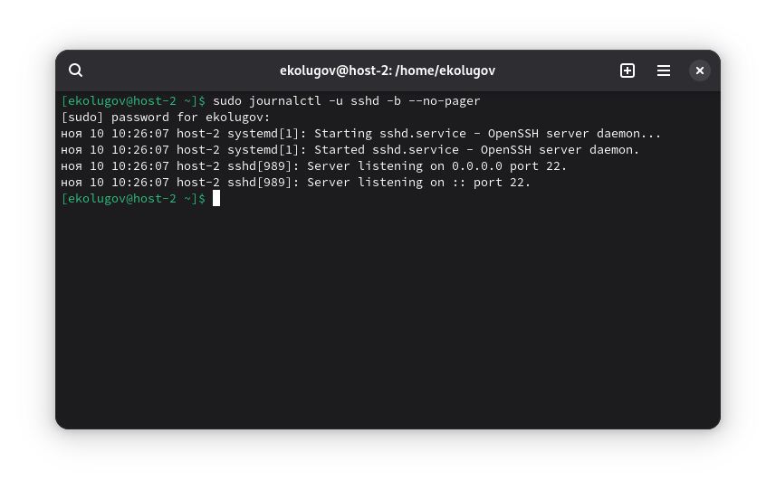
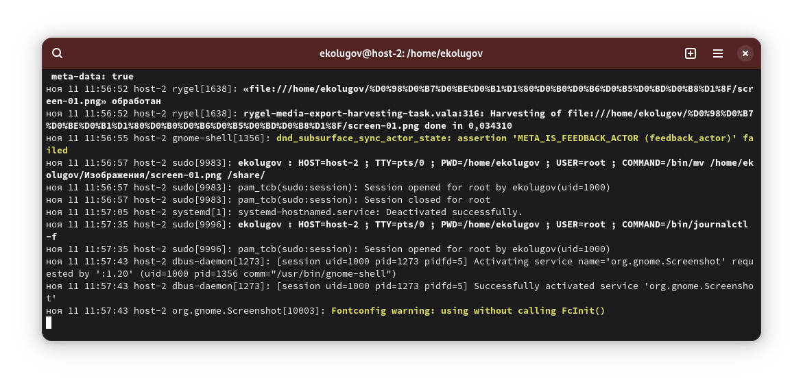
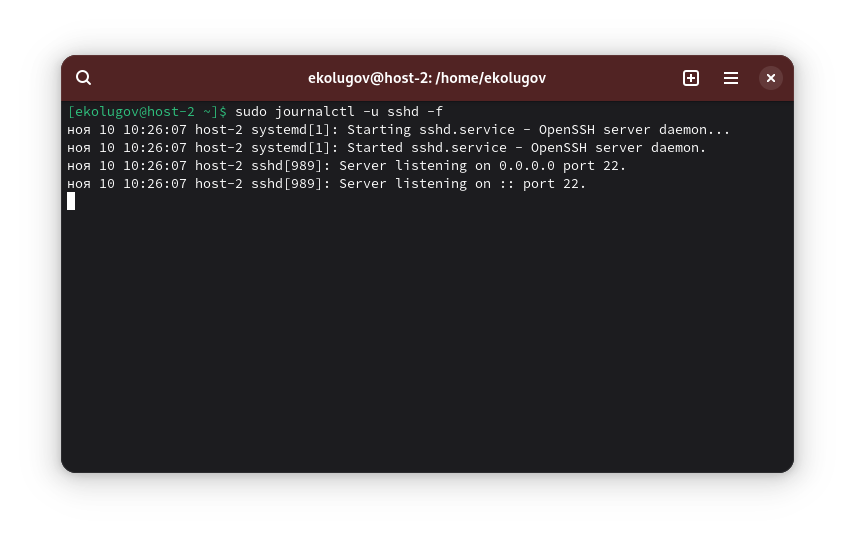

1) Посмотреть журнал ssh

```
sudo journalctl -u sshd -b --no-pager
```



2) Вывести журналы в реальном времени

```
sudo journalctl -f
```



3) Вывести лог в реальном времени для службы sshd

```
sudo journalctl -u sshd -f
```



4) Можно ли без команды journalctl прочитать логи systemd?

Нет. system-journald хранит логи в бинарном формате.

5) Сколько будет 2-2?

$$
2 - 2 = 0
$$

Кстати, интересный факт:

$$
2 + 2 = 5000
$$

