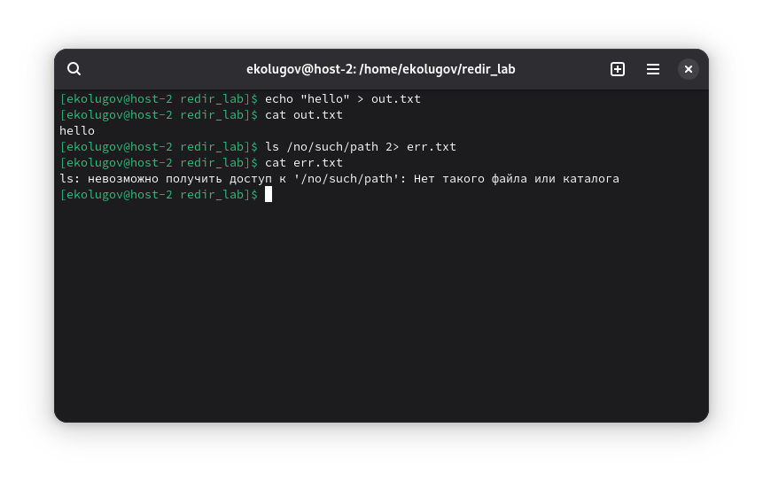
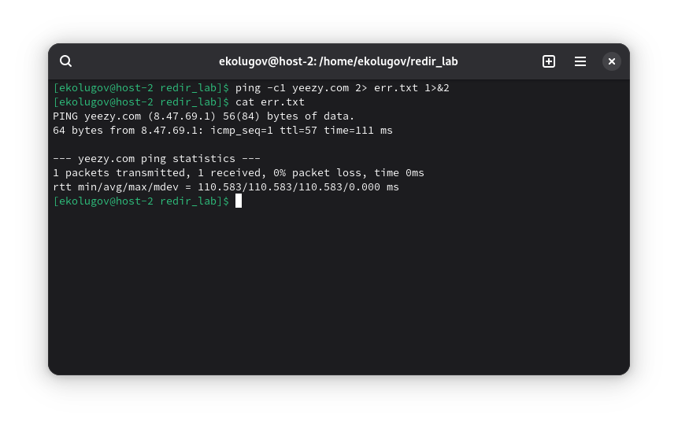
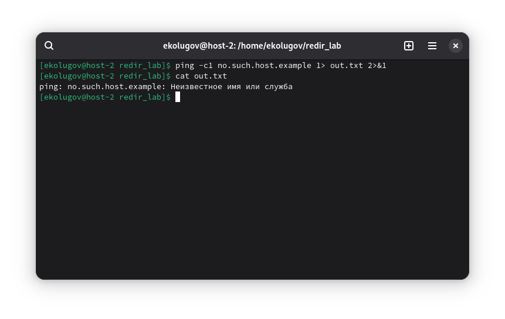

1) Как работают операторы `>` и `>>`
Демонстрация перезаписи (`>`) и дозаписи (`>>`):
```
echo "first line" > demo.txt
echo "second line" >> demo.txt
echo "second first line" > demo.txt
```


2) Что такое перенаправление ввода/вывода; `stderr` и `stdout`
Кратко:
- `stdin` (0) — стандартный ввод (обычно клавиатура или файл/канал).
- `stdout` (1) — стандартный вывод (обычно экран).
- `stderr` (2) — стандартный поток ошибок (обычно экран), отдельно от `stdout`.

Примеры:
`stdout` в файл:
```
echo "hello" > out.txt
```
`stderr` в файл:
```
ls /no/such/path 2> err.txt
```


3) Вывести содержимое файла без текстовых редакторов
Примеры инструментов для просмотра:
простой вывод:
```
cat both.txt
```
вывод начала и конца:
```
head -n 3 both.txt
tail -n 3 both.txt
```
![[screen-03.png]]

4) Создать файл с содержимым без текстовых редакторов
```
cat > poem.txt << 'EOF'
roses are red
violets are blue
alt linux rules
and so do you
EOF
```
![[screen-04.png]]

5) Перенаправить stdout в `stderr`
Перенаправляю `stdout` в `stderr`:
```
ping -c1 yeezy.com 2> err.txt 1>&2
```

Перенаправляю `stderr` в `stdout`:
```
ping -c1 no.such.host.example 1> out.txt 2>&1
```


6) Чем отличаются `stdout` и `stderr`?
Это разные потоки данных, `stdout` - обычный вывод программы: данные, результат работы. Построчная буферизация. `stderr` - диагностические сообщения: ошибки, предупреждения, логи. Как правило, не буферизируется, выводится сразу.

7) Что такое `stdin`?
Стандартный ввод (fd 0). По умолчанию — клавиатура, но может быть файлом или пайпом.

8) Как отправить весь вывод команды «в пустоту»
```
ping -c1 nike.com 1> /dev/null 2>&1
```
