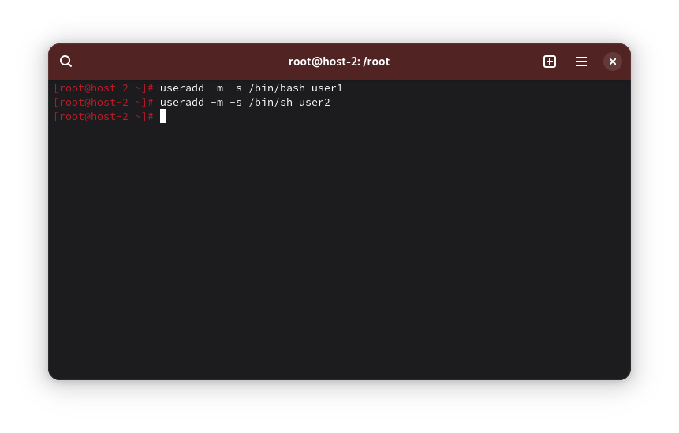
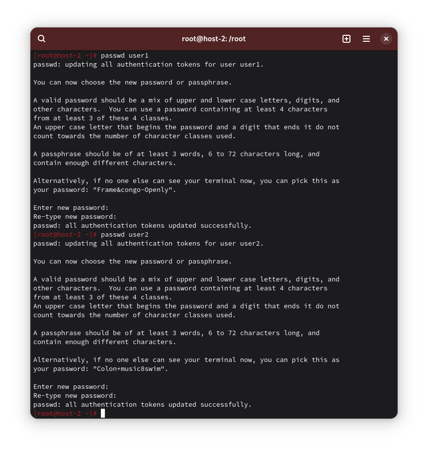
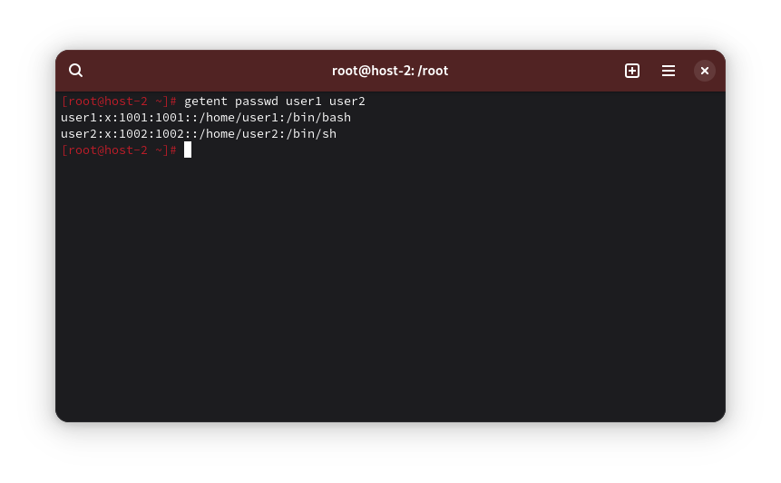
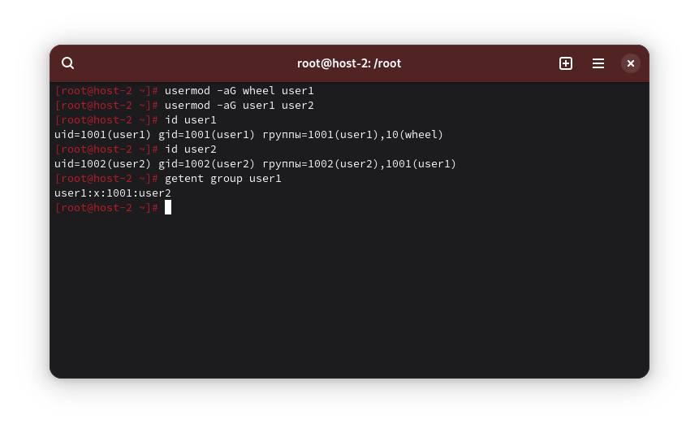
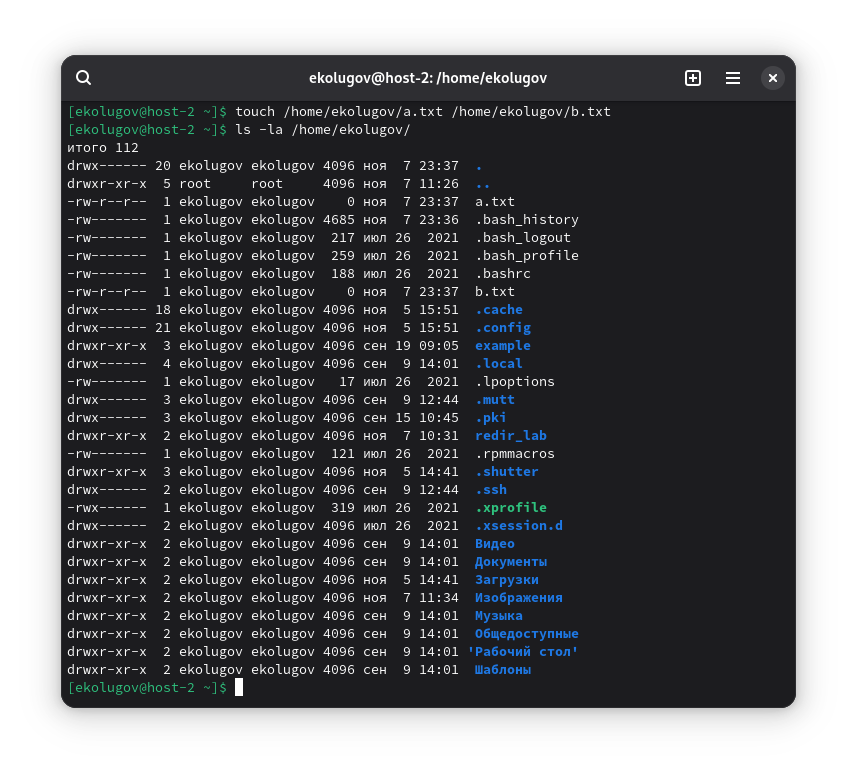
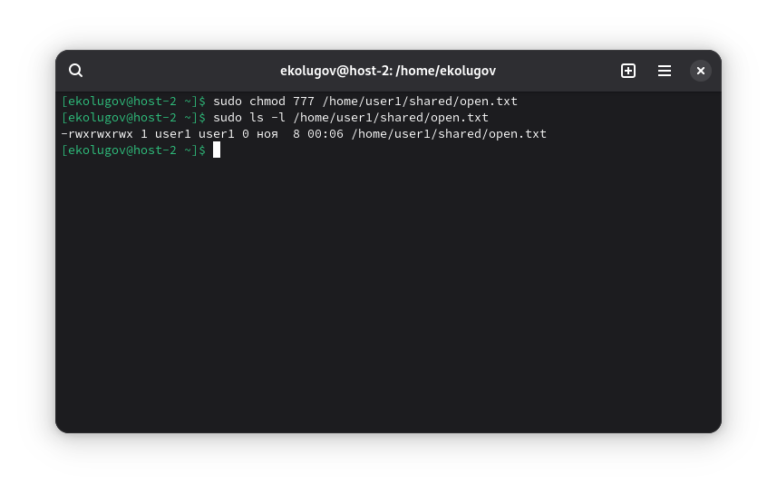
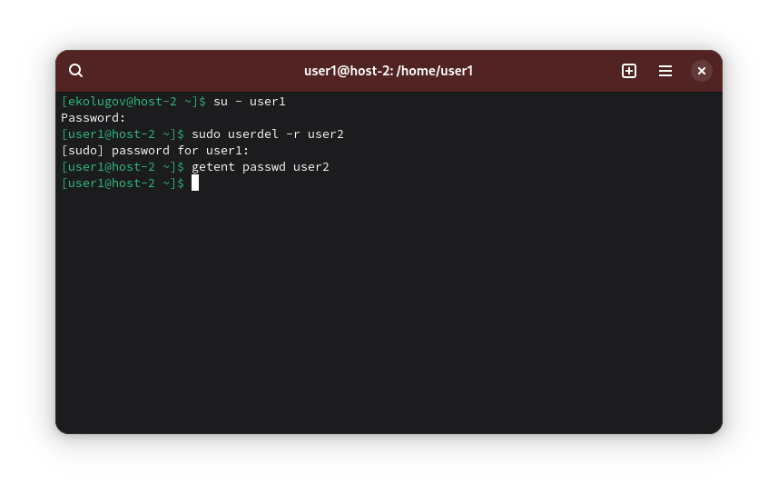

1) Добавьте пользователей user1 и user2
	- user1 - оболочка bash
	- user2 - оболочка sh
	- установите им пароли

Создаю пользователей:

```
useradd -m -s /bin/bash user1
useradd -m -s /bin/sh user2
```



Устанавливаю им пароли:

```
passwd user1
passwd user2
```



Информация о пользователях:

```
getent passwd user1 user2
```



2) Назначьте пользователю 1 группу администраторов, пользователя 2 добавьте в группу пользователя 1

```
usermod -aG wheel user1
usermod -aG user1 user2
```



3) Что такое права доступа? Выведите права доступа на файлы в директории пользователя

У каждого объекта есть владелец, группа и набор прав для группы или пользователя.

Показать права:

```
ls -la /home/ekolugov/
```



4) Как изменить права на файлы? Создайте файл который будет на который у всех пользователей будут всевозможные права.

```
chmod 777 /home/user1/shared/open.txt
```



5) Как называется учётная запись встроенного администратора в Linux?

Учётная запись встроенного администратора в Linux называется root.

6) Как выполнить команду от имени администратора?

- `sudo *команда*` - если пользователь в группе `wheel` и `sudoers` настроен
- `su -c *команда*` - выполнить одну команду от root
- `su -` - войти под рутом

7) Есть ли ограничения у суперпользователя?

Ограничений у рута почти нет, но он может быть ограничен состояниями системы (например, ФС только для чтения) или параметрами ядра/безопасности.

8) Удалите пользователя user2 с помощью user1

```
userdel -r user2
```



9) Как можно изменить владельца папки? Измените владельца папки из пункта 4.

```
chown root:root /home/user1/shared
```


