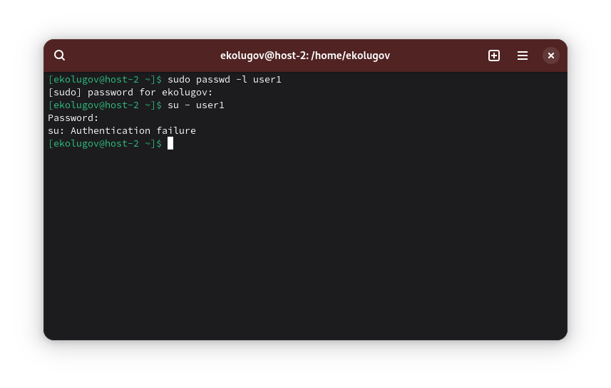
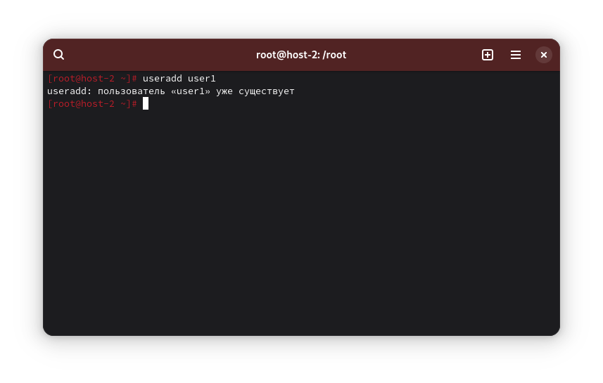

1) Запретите пользователю user1 выполнять вход в систему

```
passwd -l user1
```



2) Как вы это сделали?

`passwd -l user1` заблокирован пароль для входа под учётной записью.

3) Какие ещё способы это сделать вы знаете?

- `usermod -L user1` - аналог `passwd -l user1`
- `usermod -s /bin/false` - оболочка с тихим отказом
- `chage -E 1970-01-02 user1` - учётка истекла

3) Можно ли создать пользователей с одинаковыми username?

Нет, имена пользователей (username) в системе уникальны. Попытка создать того же пользователя завершится ошибкой.


