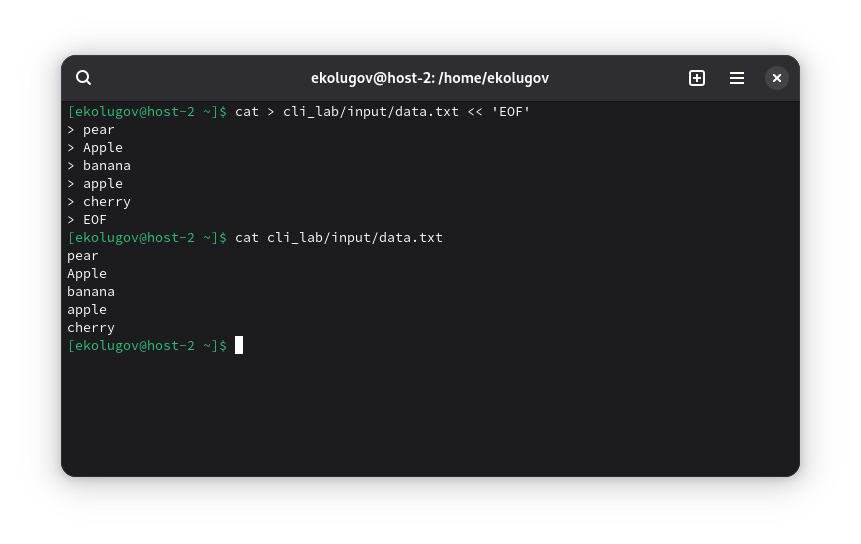
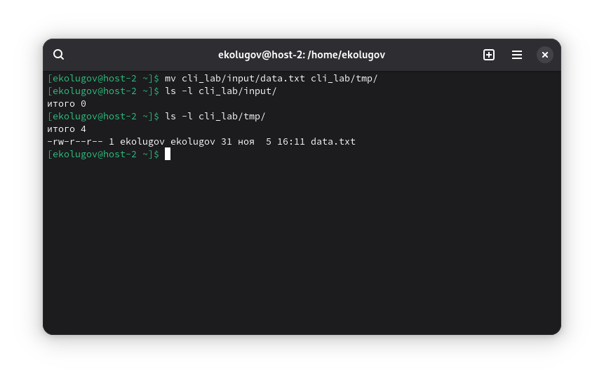
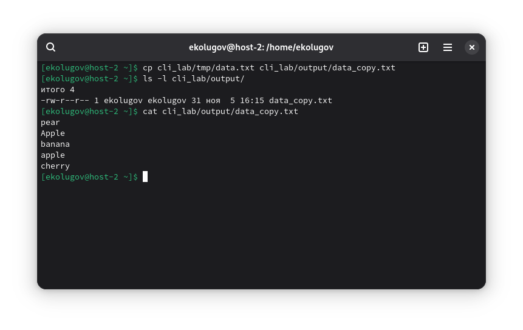
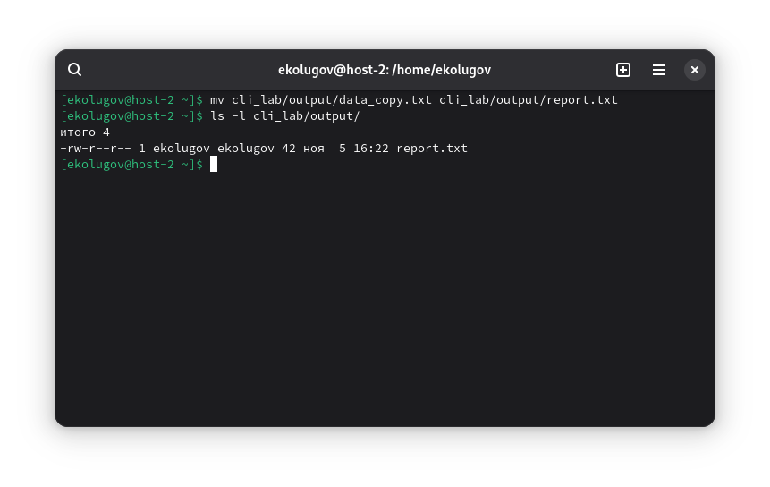
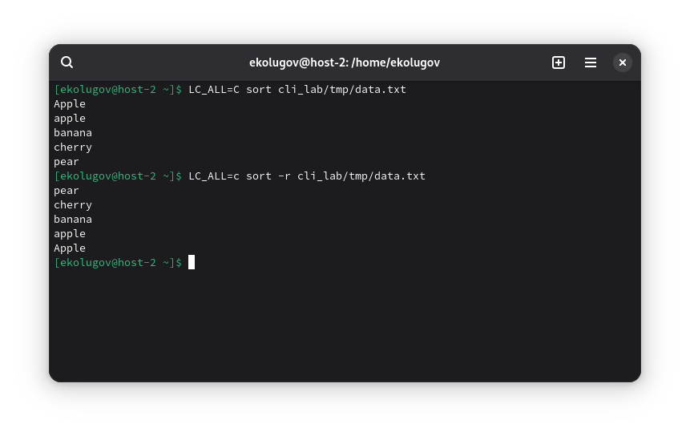

 1) Переместиться между директориями
 
Перемещаемся между домашней директорией и /tmp:
```
cd ~
pwd
cd /tmp
pwd
cd ~
pwd
```


2) Вывести список файлов в директории

Список файлов (без скрытых) текущей директории в длинном формате:
```
cd ~
ls -l
```


3) Вывести список Всех файлов в директории

```
ls -la
```


4) Создать папку с подпапками

Создадим рабочую структуру:
```
mkdir -p cli_lab/{input,output,tmp}
ls -R cli_lab
```


5) Внутри папки создать файлик и записать в него что-нибудь

Создадим файл с несколькими строками текста для дальнейших задач:
```
cat > cli_lab/input/data.txt << 'EOF'
pear
Apple
banana
apple
cherry
EOF

cat cli_lab/input/data.txt
```


6) Переместить файл из одной директории в другую

Переместим файл из input в tmp:
```
mv cli_lab/input/data.txt cli_lab/tmp/
ls -l cli_lab/input
ls -l cli_lab/tmp
```


7) Скопировать файл из одной директории в другую

Скопируем файл из tmp в output под новым именем:
```
cp cli_lab/tmp/data.txt cli_lab/output/data_copy.txt
ls -l cli_lab/output
cat cli_lab/output/data_copy.txt
```


8) Переименовать файл

Переименуем скопированный файл:
```
mv cli_lab/output/data_copy.txt cli_lab/output/report.txt
ls -l cli_lab/output
```


9) Сравнить содержимое файла

Сравним содержимое report.txt и исходного data.txt в tmp. Сначала они идентичны:
```
diff -u cli_lab/tmp/data.txt cli_lab/output/report.txt
```
Теперь внесём изменение и сравним ещё раз:
```
echo "strawberry" >> cli_lab/output/report.txt
diff -u cli_lab/tmp/data.txt cli_lab/output/report.txt
```


10) Отсортировать содержимое файла по возрастанию и убыванию

Отсортируем файл data.txt (остался в tmp). Для стабильности сортировки по байтам используем LC_ALL=C.
- По возрастанию:
```
LC_ALL=C sort cli_lab/tmp/data.txt
```
- По убыванию:
```
LC_ALL=C sort -r cli_lab/tmp/data.txt
```


11) Удалить все папки и файлы

Удалим созданную рабочую директорию целиком:
```
rm -rf cli_lab
ls -ld cli_lab || echo "cli_lab удалён"
```

